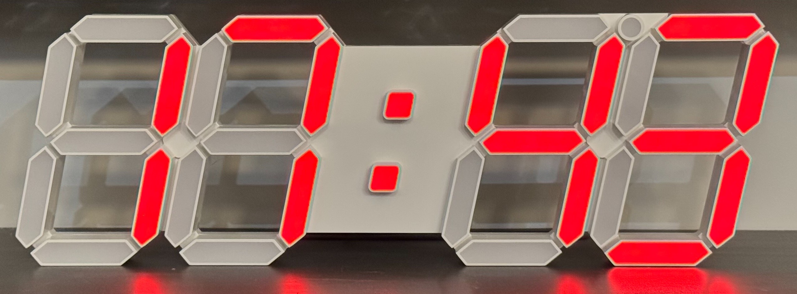
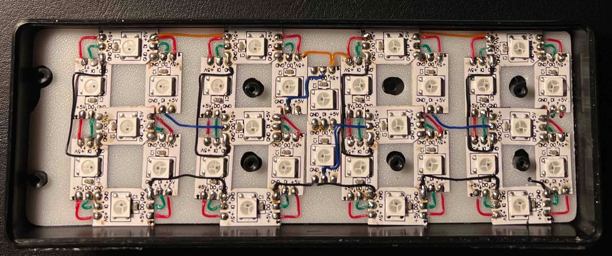

Addressable Light Digital Display
==================================

.. seo::
    :description: Instructions for setting up addressable light digital displays using LED strips
    :image: addressable_light.jpg

The ``addressable_light_digital_display`` platform allows you to create large, customizable 7-segment digital displays using addressable LED strips (like WS2812B). This display uses individual LEDs to form the segments of each digit, enabling the creation of large, bright displays with minimal hardware complexity.

    Addressable Light Digital Display

This component is particularly useful for creating digital clocks, counters, or any numeric display where you want large, easily readable digits. The display can show numbers, letters, and special characters like periods (.) and colons (:).

Key advantages over traditional 7-segment displays:

- **Scalable size**: Create displays of any size without DPI constraints using minimal LEDs
- **Easy expansion**: Add more digits with simple serial wiring (only 3-4 wires needed)
- **High brightness**: Use multiple LEDs per segment for increased brightness
- **Full color control**: Both brightness and color are easily adjustable
- **Cost effective**: Much cheaper than large traditional 7-segment LED modules

.. code-block:: yaml

    # Example configuration
    light:
      - platform: fastled_clockless
        internal: true
        id: internal_light_state
        chipset: WS2812B
        pin: GPIO33
        num_leds: 30
        rgb_order: GRB

    display:
      - platform: addressable_light_digital_display
        id: my_display
        name: "Digital Clock"
        light_id: digital_display_light
        addressable_light_id: internal_light_state
        icon: "mdi:clock-digital"
        restore_mode: ALWAYS_ON
        default_transition_length: 0s
        led_map: "BAFEDCG BAFEDCG"
        reverse: true
        update_interval: 500ms
        lambda: |-
          it.strftime("%H%M", id(sntp_time)->now());

Configuration variables:
------------------------

- **platform** (**Required**): Must be ``addressable_light_digital_display``.
- **addressable_light_id** (**Required**, :ref:`config-id`): The ID of the addressable light component to use for the display.
- **light_id** (**Required**, :ref:`config-id`): The ID to use for the light entity.
- **led_map** (**Required**, string): A string that maps each LED to the 7 segments (A-G) and special symbols. See :ref:`led_map_format` below.
- **reverse** (*Optional*, boolean): Content order. If ``true``, the first LED maps to the rightmost character. If ``false``, the first LED maps to the leftmost character. Defaults to ``true``.
- **lambda** (*Optional*, :ref:`lambda <config-lambda>`): The lambda to use for rendering content on the display.
- **update_interval** (*Optional*, :ref:`config-time`): The interval to render via the lambda and refresh the display. 
- **name** (*Optional*, string): The name of the display component.
- **icon** (*Optional*, string): The icon to use for the display component. 
- **restore_mode** (*Optional*): How to restore the light state on boot.
- **default_transition_length** (*Optional*, :ref:`config-time`): The default transition length.

All other options from :ref:`Display <config-display>` and :ref:`Light <config-light>`.

.. _led_map_format:

LED Map Format
--------------

The ``led_map`` string should reflect how LEDs are arranged to form digits based on your wiring. Each character in the string corresponds to one LED in your strip, ordered from first to last LED.

**Segment mapping:**

    .. code-block:: text

        A
       ---
    F |   | B
       -G-
    E |   | C
       ---
        D

**Valid characters:**

- **A-G**: Maps LED to corresponding 7-segment display segment
- **.** (period): Maps LED to period/decimal point
- **:** (colon): Maps LED to colon separator
- **Space**: Delimiter between digits/symbols

**Example mappings:**

.. code-block:: yaml

    # Single digit with 7 LEDs (one per segment)
    led_map: "ABCDEFG"
    
    # Two digits
    led_map: "ABCDEFG ABCDEFG"
    
    # Clock display: HH:MM with periods and colon
    led_map: ". ABCDEFG . ABCDEFG :: . ABCDEFG . ABCDEFG"
    
    # Multiple LEDs per segment (3 LEDs for segment B, 3 for segment A)
    led_map: "BBBAAA"

Required Components
-------------------

This display requires an :doc:`addressable light component </components/display/addressable_light>` such as :doc:`FastLED </components/light/fastled>` or :doc:`NeoPixelBus </components/light/neopixelbus>`.

It is recommended to set ``internal: true``. The display will be exposed as a light entity, so the underlying light component does not need to be visible.

.. code-block:: yaml

    light:
      - platform: fastled_clockless
        internal: true
        id: internal_light_state
        chipset: WS2812B
        pin: GPIO33
        num_leds: 30
        rgb_order: GRB

Lambda Functions
----------------

The display supports the following methods in lambda functions:

- ``it.print(str)``: Print a string starting at position 0
- ``it.print(pos, str)``: Print a string starting at the specified position
- ``it.printf(format, ...)``: Print formatted text using printf syntax
- ``it.printf(pos, format, ...)``: Print formatted text at the specified position
- ``it.strftime(format, time)``: Print time using strftime format
- ``it.strftime(pos, format, time)``: Print time at the specified position

**Time display example:**

.. code-block:: yaml

    time:
      - platform: sntp
        id: sntp_time

    display:
      - platform: addressable_light_digital_display
        # ... other config ...
        lambda: |-
          // Blinking colon every second
          if (millis() % 1000 < 500)
            it.strftime("%H:%M", id(sntp_time)->now());
          else
            it.strftime("%H %M", id(sntp_time)->now());

**Temperature display example:**

.. code-block:: yaml

    sensor:
      - platform: dht
        pin: GPIO2
        temperature:
          id: room_temp

    display:
      - platform: addressable_light_digital_display
        # ... other config ...
        lambda: |-
          it.printf("%.1f", id(room_temp).state);

Supported Characters
--------------------

The display supports the following characters:

**Numbers:** 0-9
**Letters:** A-Z, a-z (some letters may look similar due to 7-segment limitations)
**Symbols:** ``. : - _ ( ) [ ] ' " ! ? @ % *``
**Special:** Space (blank)

Unsupported characters will display as all segments on and generate a warning in the logs.

Hardware Setup
--------------

**Components needed:**

- **LEDs**: Any addressable LED strip supported by ESPHome (WS2812B, SK6812, etc.)
- **Microcontroller**: ESP32, ESP8266, or other ESPHome-compatible board
- **Power supply**: Ensure sufficient power for all LEDs at maximum brightness
- **Case**: 3D printed or purchased digital clock case
- **Wires**: For connecting LEDs, MCU, and power supply

**Wiring:**

Connect LEDs in series, from RIGHT to LEFT or LEFT to RIGHT. Typically requires only 3-4 wires:

- **VCC**: LED power (5V/12V) to power supply positive
- **GND**: Common ground for LEDs, MCU, and power supply  
- **Data**: LED data pin to MCU GPIO pin (normally 1-2 wires)
- **Optional**: Separate power wire for MCU if using higher voltage LEDs

    LED Wiring Example

**LED Arrangement:**

For each digit, arrange 7 LEDs (or multiples) to form the segments. The LED sequence within each digit can be configured using the ``led_map`` parameter, so physical wiring order is flexible.

Complete Example
----------------

.. code-block:: yaml

    esphome:
      name: digital-clock

    esp32:
      board: esp32dev
      framework:
        type: arduino

    wifi:
      ssid: !secret wifi_ssid
      password: !secret wifi_password

    api:
    ota:
    logger:

    time:
      - platform: sntp
        id: sntp_time
        timezone: "America/New_York"

    light:
      - platform: fastled_clockless
        internal: true
        id: internal_light_state
        chipset: WS2812B
        pin: GPIO33
        num_leds: 90  # 4 digits × ~22 LEDs per digit + periods/colon
        rgb_order: GRB

    display:
      - platform: addressable_light_digital_display
        id: digital_clock
        name: "Digital Clock"
        light_id: digital_display_light
        addressable_light_id: internal_light_state
        icon: "mdi:clock-digital"
        restore_mode: ALWAYS_ON
        default_transition_length: 0s
        # Map for HH:MM display with periods and colon
        led_map: ". CCCDDDEEEFFFAAABBBGGG . CCCDDDEEEFFFAAABBBGGG :: . CCCDDDEEEFFFAAABBBGGG . CCCDDDEEEFFFAAABBBGGG"
        reverse: true
        update_interval: 500ms
        lambda: |-
          // Blinking colon clock display
          if (millis() % 1000 < 500)
            it.strftime("%H:%M", id(sntp_time)->now());
          else
            it.strftime("%H %M", id(sntp_time)->now());

Troubleshooting
---------------

**Display on but frozen when turning on**

- Check voltage of the microcontroller; LEDs are power hungry and can pull down the voltage, causing the microcontroller to restart or malfunction.
- Ensure the power supply can provide enough current for all LEDs at full brightness.
- Inspect wiring for loose or poor connections, especially at power and data lines.
- Make sure the power wires are not too thin or long, which can cause voltage drops.

**Display not showing anything:**

- Ensure the light is turned on (unless ``restore_mode: ALWAYS_ON`` is set)
- Check that ``addressable_light_id`` matches your light component ID
- Verify LED wiring and power supply
- Check ``num_leds`` matches your actual LED count

**Wrong segments lighting up:**

- Verify your ``led_map`` string matches your physical LED arrangement
- Check if ``reverse`` setting needs to be toggled
- Ensure LED strip data direction matches your configuration

**Characters not displaying correctly:**

- Some characters may not be representable in 7-segment format
- Check the supported character list above
- Use alternative characters or abbreviations

**Performance issues:**

- Reduce ``update_interval`` if display updates are too slow
- Ensure adequate power supply for all LEDs
- Consider reducing LED brightness for power consumption

See Also
--------

- :doc:`/components/display/index`
- :doc:`/components/light/fastled`
- :doc:`/components/light/neopixelbus`
- :doc:`/components/time/index`
- :apiref:`addressable_light_digital_display/digital_display.h`
- :ghedit:`Edit`
