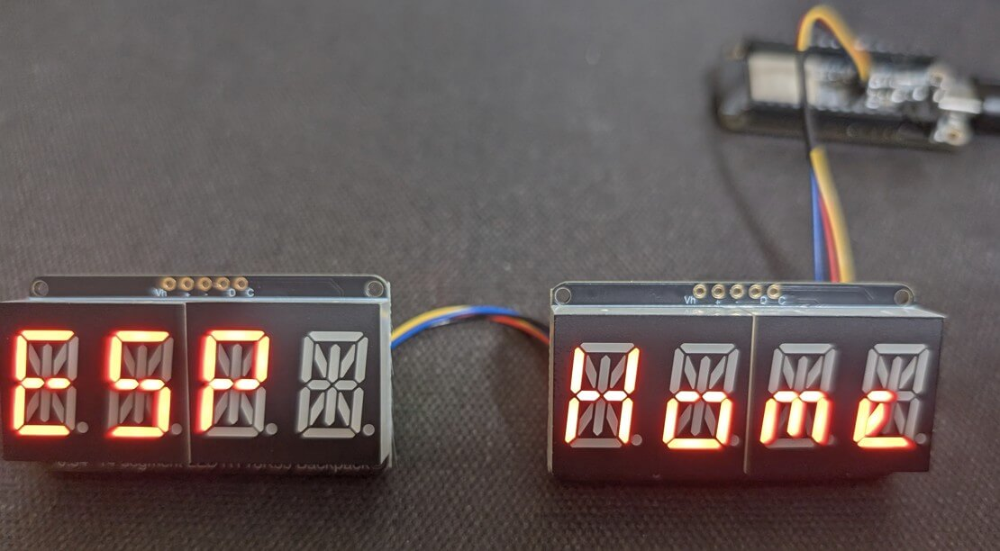

HT16K33 Character Based Displays
======================================

.. seo::
    :description: Instructions for setting up HT16K33 character displays.
    :image: ht16k33-char.jpg

The ``ht16k33`` display platform allows you to use a character display that is driven by a HT16k33
chip with ESPHome. Please note that this component is *only* for character displays. The chip is 
capable of driving arbitrary arrays of LEDs, but that configuration is not supported by this component.



    Two HT16k33 based displays.

This component supports scrolling messages and spanning the message across multiple displays. It is
based on the excellent `ht16k33-alpha library <https://github.com/ssieb/esphome_components/tree/2e82fc3a5acc3d1f4ca6b47cbe656f4217d382ac/components/ht16k33_alpha>`__, but generalized for a wider range of character based devices.

.. _currently_supported_devices:

Currently Supported Devices:
-----------------------------------------

See :ref:`ht16k33-char_device_details` for more info on these devices and :ref:`ht16k33-char_new_devices` for instructions on adding support for new devices.

+------------------------------------------------------------------------------------+--------------------------------------+
| Device                                                                             | Device ID(s)                         |
+====================================================================================+======================================+
| `Adafruit 1.2" 4-Digit 7-Segment <https://www.adafruit.com/product/1270>`__        | ``ADAFRUIT_7SEGMENT_1.2IN``          |
|                                                                                    | ``ADAFRUIT_7SEGMENT_1.2IN_FLIPPED``  |
+------------------------------------------------------------------------------------+--------------------------------------+
| `Adafruit 0.56" 4-Digit 7-Segment <https://www.adafruit.com/product/878>`__        | ``ADAFRUIT_7SEGMENT_.56IN``          |
|                                                                                    | ``ADAFRUIT_7SEGMENT_.56IN_FLIPPED``  |
+------------------------------------------------------------------------------------+--------------------------------------+
| `Adafruit 0.54" 4-Digit 14-Segment <https://www.adafruit.com/product/1911>`__      | ``ADAFRUIT_14_SEG``                  |
|                                                                                    | ``ADAFRUIT_14_SEG_FLIPPED``          |
+------------------------------------------------------------------------------------+--------------------------------------+

Prerequisites:
-----------------------------------------

This component relies on the :ref:`I²C <i2c>` componenent to be setup. See the reference for
that component for details. A basic example of what that looks like is below.

.. code-block:: yaml

    i2c:
      sda: SDA
      scl: SCL
      scan: true

Configuration Example:
-----------------------------------------
An example configuration YAML is shown below.

.. code-block:: yaml

    display:
      - platform: ht16k33_char
        device: ADAFRUIT_14_SEG
        address: 0x71
        buffer_size: 12
        scroll: true
        continuous: false
        secondary_displays:
          - address: 0x70
        lambda: |-
          it.print(0, true, "ESP Home");

Configuration variables:
-----------------------------------------

- **device** (*Required*): The type of device attached. 

  - Choses the device type. Available types are shown in the :ref:`currently_supported_devices`.

- **address** (*Optional*): The address of the base HT16k33.

  - The i2c address of the display driver.
  - If you have multiple display drivers, this should be the address of the first display.
  - Defaults to 0x70

- **buffer_size** (*Optional*): The size of the character buffer. The length of this buffer is the longest message you can display.

  - This should be, at minimum, the number of characters on the display you are using. 
  - You can make it longer if you want to scroll messages that are longer than the display can show all at once.
  - If not set, it defaults to 8. Limited to 255.

- **brightness** (*Optional*): Set the brightness of the display.

  - Set the brightness of the display from 1 (dimmest) to 16 (brightest).
  - If not set, it defaults to 15.

- **secondary_displays** (*Optional*): Set to configure secondary displays.

  - Use this to define other displays if you have more than one.
  - Provide a list of i2c addresses for the secondary displays. The order of the list should match the order of how the displays are physically aligned. Eg: the first provided address will be the second device, the second provided with be the third device, etc...

- **scroll** (*Optional*): Set to ``true`` to enable scrolling on the display(s). Will scroll the message in the buffer based on the following parameters.
    
    - **continuous** (*Optional*):

      - If set to ``true``, will loop the message in the buffer. 
      - If set to ``false``, when the message reaches the end of the buffer, the display will wait a set time and then start the message over.
      - Defaults to ``false``
    - **scroll_speed** (*Optional*): The time between the scroll movements.

      - Defaults to ``1s``.
    - **scroll_delay** (*Optional*): When not in continuous mode, the time to hold at the start of the message before starting to scroll (in seconds).

      - Ignored in continuous mode.
      - Defaults to ``5s``.
    - **scroll_dwell** (*Optional*): When not in continuous mode, the time to hold at the end of the message before restarting (in seconds).

      - Ignored in continuous mode.
      - Defaults to ``2s``.
      
  - If the buffer size is smaller than the number of characters available, the message will not scroll.
  - Defaults to ``false``


.. _ht16k33-char_lambda:

Using Lambda
-----------------------------

The HT16k33-char component implements a simplified version of the lambda used in other displays.
In the lambda you're passed a variable called ``it`` as with all other displays. In this case 
however, ``it`` is the HT16k33 instance.

Commands available in lambda to place characters on the display:
*******************************************************************

  - ``it.print(start_pos, clear_buffer, string)``: Prints a string to the buffer.

    - *start_pos*: The position in the buffer to place the string. Starts at 0 for the first position in the buffer.
    - *clear_buffer*: Whether to clear the buffer before placing the message. Set to `true` to clear the buffer before adding the new message.
    - *string*: A char string of the message to place in the buffer. If the message is longer than the buffer, it will be truncated to fit.

  - ``it.print(clear_buffer, string)``: Prints a string to the start of the buffer.

    - *clear_buffer*: Whether to clear the buffer before placing the message. Set to `true` to clear the buffer before adding the new message.
    - *string*: A char string of the message to place in the buffer. If the message is longer than the buffer, it will be truncated to fit.

  - ``it.printf(start_pos, clear_buffer, <standard printf arguments>)``: Implements printf to place a formatted string into the buffer.

    - *start_pos*: The position in the buffer to place the string. Starts at 0 for the first position in the buffer.
    - *clear_buffer*: Whether to clear the buffer before placing the message. Set to ``true`` to clear the buffer before adding the new message.
    - The rest of the arguments of this function will be passed to the printf function to generate a formatted string.

  - ``it.strftime(start_pos, clear_buffer, format, time)`` : Generate a time string using strftime. TODO: A link to the strfrime man page?

    - *start_pos*: The position in the buffer to place the string. Starts at 0 for the first position in the buffer.
    - *clear_buffer*: Whether to clear the buffer before placing the message. Set to `true` to clear the buffer before adding the new message.
    - *format*: the formatting string expected by `strftime()`.
    - *time* an ESPTime object of the time you want to display.

  - ``it.clock_display(start_pos, clear_buffer, show_leading_zero, use_am_pm, time)``: A simplified function that will display the time in the format HOUR:MINUTE.

    - *start_pos*: The position in the buffer to place the string. Starts at 0 for the first position in the buffer.
    - *clear_buffer*: Whether to clear the buffer before placing the message. Set to `true` to clear the buffer before adding the new message.
    - *show_leading_zero*: Whether to show the leading 0 (for example in 01:30). Set to `true` to show the leading zero.
    - *use_am_pm*: Whether to use 12 or 24 hour time. Set to `true` to convert the time display to 12 hour mode.
    - *time* an ESPTime object of the time you want to display.
    
Other commands avaialable in lambda:
*******************************************************************

  - ``it.brightness(value)``: Sets the display brightness to `value`. Must be between 0-16. Setting to zero turns off the display, setting to 16 is full brightness.
  - ``it.blank()``: Clears the display memory. This will turn off all digits. Not technically the same as turning off the device, but the result is the same.
  - ``it.display_off(turn_off)``: Takes a boolean to turn the display on or off. Set `turn_off` to `true` to turn off the display.
  - ``it.display_standby(standby)``: Takes a boolean to put the display in standby mode. Set `standby` to `true` to place the display(s) into standby mode. This is probably a lower power state than just turning off the display, but I have not tested that.
  - ``it.set_blink(blink_state)``: Set the blink state of the device. The HT16k33 is capable of blinking the display independently of the CPU. Valid values for `blink_state` are:

    - ``0``: No blinking
    - ``1``: Blink rate of 2Hz
    - ``2``: Blink rate of 1Hz
    - ``3``: Blink rate of .5Hz
    - Any other value given to this function will turn off the blinking.

Please see :ref:`display-printf` for a quick introduction into the ``printf`` formatting rules and :ref:`here <strftime>` for an introduction into the ``strftime`` time formatting.

.. _ht16k33-char_device_details:

Device details
------------------------

Note that the only thing that is device specific is how the LEDs are wired to the driver chip. If you have another board that is wired the same way as one of the supported devices, you can use that device type and it should work fine.

A list of supported characters is given for each device. If you place a non-supported character in the buffer, the device will display a blank space when trying to display that character.

.. collapse:: Adafruit 1.2" 4-Digit 7-Segment

    Large 7 segment displays from `Adafruit <https://www.adafruit.com/product/1270>`__. They have various colors and all the colors should work the same. The wiring diagram for the device is supposedly `here <https://learn.adafruit.com/assets/122068>`__. However, as of this writing (3/2025) that wiring diagram appears to be incorrect. Based on my testing, the display is actually wired similar to their `smaller displays <https://learn.adafruit.com/assets/108790>`__, with the exception of the decimal points and colons.
  
    Both a right-side-up and upside-down version of this display is implemented here. To use them set ``device`` to ``ADAFRUIT_7SEGMENT_1.2IN`` or ``ADAFRUIT_7SEGMENT_1.2IN_FLIPPED``.

    I have implemented a subset of the most useful characters that display properly on a 7 segment display. There does not appear to be a standard for displaying other alphanumeric characters, and I did not implement some of the more esoteric character interpretations. If you need more characters, I suggest using a 14 character device or submitting a PR to add to this list.

    .. collapse:: Supported Characters

        - All numerals (0-9)
        - `` (a blank space)``
        - ``A``
        - ``b``
        - ``C``
        - ``c``
        - ``d``
        - ``E``
        - ``F``
        - ``G``
        - ``H``
        - ``h``
        - ``I``
        - ``J``
        - ``L``
        - ``N``
        - ``O (Capital letter O)``
        - ``o (Lower case letter o)``
        - ``P``    
        - ``r``
        - ``S``
        - ``t``
        - ``U``
        - ``u``
        - ``Y``

    Aside from the standard characters, this display also has:
  
      - A colon before the first digit. The two leds can be controlled independently.

        - Use the character ``'`` or ````` to light the upper LED.
        - Use the character ``.`` to light the lower LED.
        - Use the character ``:`` to light both LEDs.

      - A colon between digit 2 and 3. These two LEDs are wired together.

        -Use the character ``:`` to light these LEDs.

      - A LED on the top side of the display between digits 3 and 4.

        - Use the character ``'`` or ````` to light this LED.
    
    For the flipped version of this display, the `````, ``'``, ``:`` and ``.`` characters work as expected if placed in the correct locations.

    These characters must be placed in the correct position in the character buffer to turn on the relevant LED. If they are placed in any other position, they will be treated as an unsupported character.

.. collapse:: Adafruit 0.56" 4-Digit 7-Segment

    Small 7 segment displays from `Adafruit <https://www.adafruit.com/product/865>`__. They have various colors and all the colors should work the same. The wiring diagram for the device is `here <https://learn.adafruit.com/assets/108790>`__.
  
    Both a right-side-up and upside-down version of this display is implemented here. To use them set ``device`` to ``ADAFRUIT_7SEGMENT_.56IN`` or ``ADAFRUIT_7SEGMENT_.56IN_FLIPPED``.

    I have implemented a subset of the most useful characters that display properly on a 7 segment display. There does not appear to be and standard for displaying other alphanumeric characters, and I did not implement some of the more esoteric character interpretations. If you need more characters, I suggest using a 14 character device or submitting a PR to add to this list.

    .. collapse:: Supported Characters

        - All numerals (0-9)
        - `` (a blank space)``
        - ``A``
        - ``b``
        - ``C``
        - ``c``
        - ``d``
        - ``E``
        - ``F``
        - ``G``
        - ``H``
        - ``h``
        - ``I``
        - ``J``
        - ``L``
        - ``N``
        - ``O (Capital letter O)``
        - ``o (Lower case letter o)``
        - ``P``    
        - ``r``
        - ``S``
        - ``t``
        - ``U``
        - ``u``
        - ``Y``

    Aside from the standard characters, this display also has:
  
      - A decimal point after each digit

        - Use the ``.`` character to turn on a decimal point.
        - Note that if you are using the upside-down version of the display, use ``'`` to light the decimal point that is now at the top of the display.

      - A colon between digit 2 and 3. These two LEDs are wired together.

        -Use the character ``:`` to light these LEDs.

      - Note that while it is technically possible to turn on both the decimal point after digit 2 and the colon after digit 2, I did not implement that in this code. If you try to do this, the first character you set will be displayed and the next one will be interpreted as an invalid character at position 3.

    These characters must be placed in the correct position in the character buffer to turn on the relevant LED. If they are placed in any other position, they will be treated as an unsupported character.

.. collapse:: Adafruit 0.54" 4-Digit 14-Segment

    Small 14 segment displays from `Adafruit <https://www.adafruit.com/product/1911>`__. They have various colors and all the colors should work the same. The wiring diagram for the device is `here <https://learn.adafruit.com/assets/114463>`__.
  
    Both a right-side-up and upside-down version of this display is implemented here. To use them set ``device`` to ``ADAFRUIT_14_SEG`` or ``ADAFRUIT_14_SEG_FLIPPED``.

    I have implemented most of the basic alphanumeric characters and punctuation. Some of them are a bit of a strech to display on these devices, but they are generally readable.

    .. collapse:: Supported Characters

        - All upper case english characters (A-Z)
        - All lower case english characters (a-z)
        - All numerals (0-9)
        - a blank space
        - ``!``
        - ``"``
        - ``#``
        - ``$``
        - ``%``
        - ``&``
        - ``'``
        - ``(``
        - ``)``
        - ``*``
        - ``+``
        - ``,``
        - ``-``
        - ``/``
        - ``:``
        - ``;``
        - ``<``
        - ``=``
        - ``>``
        - ``?``
        - ``@``
        - ``[``
        - ``\``
        - ``]``
        - ``^``
        - ``_``
        - ``\```
        - ``{``
        - ``|``
        - ``}``
        - ``~``

    Aside from the standard characters, this display also has:
  
      - A decimal point after each digit

        - Use the ``.`` character to turn on a decimal point.
        - Note that if you are using the upside-down version of the display, I did not implement any way to light the decimal points that are now at the top of the display. The display itself is capable of displaying the ``'`` character, so I did not figure it was worth it to also be able to light the decimal point. This could be changed in the future is anyone finds a use for those decimal points.

    These characters must be placed in the correct position in the character buffer to turn on the relevant LED. If they are placed in any other position, they will be treated as an unsupported character.

.. _ht16k33-char_new_devices:

Adding New Devices
------------------------

I tried to structure this library so that it would be (relatively) easy to add other devices. The basic steps to add a new device is:

1. In ``display.py``: Modify the ``HT16K33_DEVICE_TYPES`` dictionary to add a definition for your device.

      * They keys are what the user will put in the YAML file for the ``device`` setting.
      * The ``CLASS_NAME`` values associated with those keys are the name of the associated
        class that you will define for this device. The name can be pretty much anything,
        but make it something unique and descriptive.

2. In the ``esphome\components\ht16k33_char`` folder:
   Add in a ``.cpp`` and ``.h`` file for your new device. The filename can be pretty much anything,
   but it is probably best to make it similar to your class name. This is where all the device
   specific magic happens.

   These files need to define the class you named in #1 above and implement a ``send_to_display()``
   function inside this class. This function will be given the character buffer and the location
   in the buffer of the start of the string to display, and it should implement any device specific
   stuff to make the characters appear on the display the way you want.

3. In this documentation:
   Update the documentation to describe your added device.

Special Thanks
-----------------------------------------

 - ssieb and his `ht16k33-alpha library <https://github.com/ssieb/esphome_components/tree/2e82fc3a5acc3d1f4ca6b47cbe656f4217d382ac/components/ht16k33_alpha>`__ that I borrowed heavily from.
 - The authors and contributors for the :doc:`MAX7219 component <max7219>` for providing an additional example.
