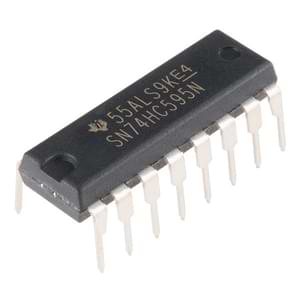

Serial Shift Register Multiplexed Displays
==========================================

.. seo::
    :description: Instructions for setting up a serial shift register based display.
    :image: serial_multiplexed_display.jpg

The ``serial_multiplexed_display`` display platform allows you to use (for now) two different kinds of serial shift registers to drive segment displays with ESPHome.

    SN74HC595 Serial Shift Register.

These devices normally require three GPIO inputs, clock, data, and latch.  These pins can be configured for the component like below.

.. code-block:: yaml

    # Example configuration entry
    display:
    - platform: serial_multiplexed_display
      model: sn74hc595
      latch_pin: GPIO35
      clk_pin: GPIO34
      data_pin: GPIO33
      common_cathode: True
      reversed: True
      lambda: |-
        it.printf("%s", "1234");

Configuration variables:
------------------------

- **model** (**Required**, string): The model of the shift register, one of ``sn74hc595``, or ``ct1642``.
- **data_pin** (**Required**, :ref:`Pin Schema <config-pin_schema>`): The pin for serial data.
- **clk_pin** (**Required**, :ref:`Pin Schema <config-pin_schema>`): The pin for the serial clock.
- **latch_pin** (**Required**, :ref:`Pin Schema <config-pin_schema>`): The pin for the latch signal.
- **length** (*Optional*, int): The number of segment displays connected to the shift registers. (defaults to 4, must be between 1 and 8)
- **lambda** (*Optional*, :ref:`lambda <config-lambda>`): The lambda to use for rendering the content on the TM1621.
  See :ref:`display-serial_multiplexed_display_lambda` for more information.
- **common_cathode** (*Optional*, boolean): True if the displays are configured as common cathode.
- **reversed** (*Optional*, boolean): True to reverse the display order of the segment displays.
- **update_interval** (*Optional*, :ref:`config-time`): The interval to re-draw the screen. Defaults to ``1s``.
- **id** (*Optional*, :ref:`config-id`): Manually specify the ID used for code generation.

.. _display-serial_multiplexed_display_lambda:

Rendering Lambda
----------------

This component has a similar API to the fully fledged :ref:`display-engine`, but it's only a subset as it's intended to
be used with segment displays (such as 7 segments) and does not have a concept of individual pixels.
In the lambda you're passed a variable called ``it`` as with all other displays. In this case however, ``it`` is a SerialMultiplexedDisplay
instance (see API Reference).

The most basic operation is writing a simple number to the screen as in the configuration example
at the top of this page. But even though you're passing in a string (here ``"1234"``), ESPHome converts it
into a representation that the connected segments can understand.

This component does not support the decimal point on displays, yet.

.. code-block:: yaml

    display:
      - platform: serial_multiplexed_display
        # ...
      lambda: |-
        it.printf("%d", id(my_sensor1).state);

Please see :ref:`display-printf` for a quick introduction into the ``printf`` formatting rules.

See Also
--------

- :doc:`index`
- :ghedit:`Edit`
