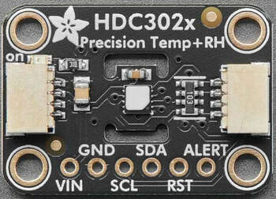

HDC302x Temperature & Humidity Sensor
=====================================

.. seo::
    :description: Instructions for setting up HDC302x temperature and humdiity sensor in ESPHome.
    :image: hdc302x.jpg

    Adafruit board for HDC302X.

            
Component
---------

The hdc302x component allows you to talk with the TI HDC302X series (`datasheet <https://www.ti.com/lit/ds/symlink/hdc3020.pdf>`__, `Adafruit <https://learn.adafruit.com/adafruit-hdc3021-precision-temperature-humidity-sensor/overview>`__) of temperature and humidity sensors over I2C.  The :ref:`I2C <i2c>` is required to be set up in your configuration for this sensor to work.
            
.. code-block:: yaml

    # Minimal configuration entry to report temperature & humidity
    hdc302x:
      temperature:
        name: temp_a
        id: temp_a
      humidity:
        name: humidity_a
        id: humidity_a

Configuration variables:
************************

- **temperature** (*Optional*, :ref:`config-sensor`): Sensor configuration for temperature readings.  If omitted, temperature will not be reported.
- **humidity** (*Optional*, :ref:`config-sensor`): Sensor configuration for humidity readings.  If omitted, humidity will not be reported.
- **last_error** (*Optional*, :ref:`config-text_sensor`): Configuration for text sensor reporting last error encountered talking to the hdc302x sensor.
- **i2c_id** (*Optional*): The I²C Bus ID to use.
- **update_interval** (*Optional*, :ref:`config-time`): Interval in seconds between temperature and humidity updates.
  Defaults to ``60s``.

See Also
--------

- :ref:`i2c`
- :ref:`config-sensor`
- :ref:`config-text_sensor`
- :apiref:`API Reference (HDC302X) <hdc302x/hdx302x.h>`
- :ghedit:`Edit`
