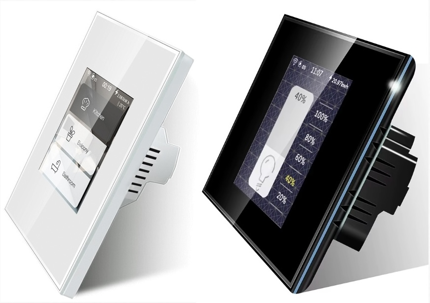

Lanbon L8-HD Dimmer
===================

.. seo::
    :description: Instructions for setting up a Lanbon L8-HD dimmer switch.
    :image: brightness-medium.svg

The ``lanbon_l8_hd`` light platform creates a simple brightness-only light for the
hardware found in `Lanbon L8-HD dimmer <https://www.lanbon.cn/l8-dimmer-switch/53378091>`__.
Use this component to integrate a Lanbon L8-HD dimmer into ESPHome / Home Assistant ecosystem.

    Lanbon L8 switch/dimmer, US/EU versions . Image by `Lanbon <hhttps://www.lanbon.cn/l8-dimmer-switch/5337809>`__.

The Lanbon L8-HD another MCU for light dimming.
It's hooked up to a ESP32 via a UART Tx pin on GPIO12 and powered via a relay controlled by GPIO27.
Uni-directional commands are sent from the ESP32 to the MCU.
``lanbon_l8_hd`` component implements this protocol and translates between HA light commands and serial messages.

To replace the stock firmware with ESPHome, follow the detailed instructions kindly provided by `blackadder <https://blakadder.com/lanbon-L8-custom-firmware/>`.

Before using this components make sure:

- board is configured to ``esp32``
- :ref:`UART bus <uart>` is configured with TX pin 12, 115200 baud rate and 8N1 data format.

This component is useless for devices other than Lanbon L8-HD dimmers.

.. code-block:: yaml

    # UART used by the dimmer
    uart:
      tx_pin:
        number: GPIO12
        inverted: false   # true for EU
      id: dimmer_tx
      baud_rate: 115200
      data_bits: 8
      parity: NONE
      stop_bits: 1

    # And finally the light component
    # gamma correction equal to zero gives linear scale,
    light:
      - platform: lanbon_l8_hd
          name: "Light"
          id: local_dimmer
          restore_mode: ALWAYS_OFF
          gamma_correct: 0.0

See https://devices.esphome.io/devices/lanbon_l8 for a complete configuration example for this device, including
the screen backlight and RBG moodlight.

Configuration variables:
------------------------

- **min_value** (*Optional*, int): The lowest dimmer value allowed. Acceptable value for your
  setup will depend on actual light bulbs installed and number of them. Start with the default
  value and check what will be the minimal brightness bulbs can render. Pay attention that for
  some dimmable LED lamps minimal turn-on brightness will be higher that the minimal achievable
  brightness if you just decrease it when lamp is already turned on. Defaults to 0.
- **max_value** (*Optional*, int): The highest dimmer value allowed. Use this to hard-limit light
  intensity for your setup. For some bulbs this parameter might be also useful to prevent
  flickering at high brightness values. Defaults to 100.
- All other options from :ref:`Light <config-light>`.

See Also
--------

- :doc:`/components/light/index`
- :doc:`/components/uart`
- :ghedit:`Edit`
