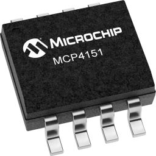

MCP4151 Potentiometer Output
============================

.. seo::
    :description: Instructions for setting up a MCP4151 digital potentiometer with ESPHome.
    :image: description.svg

The ``MCP4151`` output platform allows you to add an output that controls a `MCP4151 digital potentiometer <https://ww1.microchip.com/downloads/aemDocuments/documents/OTH/ProductDocuments/DataSheets/22060b.pdf>`__.

    MCP4151 digital potentiometer

The MCP4151 family of digital potentiometers are available in different resistance values.

==================== =====================
``MCP4151-502E/P``   ``5kΩ``
-------------------- ---------------------
``MCP4151-103E/P``   ``10kΩ``
-------------------- ---------------------
``MCP4151-503E/P``   ``50kΩ``
-------------------- ---------------------
``MCP4151-104E/P``   ``100kΩ``
==================== =====================

All chips are controlled by a SPI interface and feature 256 possible wiper positions.

.. code-block:: yaml

    # Example configuration entry
    spi:
      clk_pin: GPIOXX
      mosi_pin: GPIOXX

    output:
      - platform: mcp4151
        id: digital_pot
        cs_pin: GPIOXX

Configuration variables:
------------------------

- **id** (**Required**, :ref:`config-id`): The id to use for this output component.
- **cs_pin** (**Required**, :ref:`Pin Schema <config-pin_schema>`): SPI Chip Select pin
- All other options from :ref:`Output <config-output>`.

See Also
--------

- :doc:`/components/output/index`
- :apiref:`mcp4151/mcp4151.h`
- :ghedit:`Edit`
