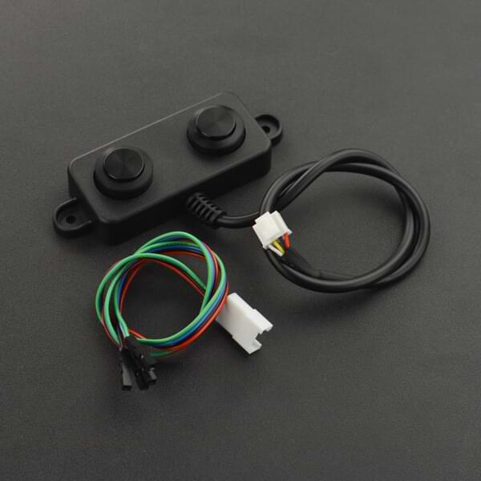

A02YY Waterproof Ultrasonic Sensor
====================================

.. seo::
    :description: Instructions for setting up A02YYUW and A02YYTW waterproof ultrasonic distance sensor in ESPHome.
    :image: a02yyuw.jpg
    :keywords: ultrasonic, DFRobot, A02YYUW, A02YYTW, A02

This sensor allows you to use A02YYUW and A02YYTW waterproof ultrasonic sensors
(`datasheet <https://www.dypcn.com/uploads/A02-Datasheet.pdf>`__)
with ESPHome to measure distances. These sensors can measure
ranges between 3 centimeters and 450 centimeters with a resolution of 1 millimeter.

Since this sensors can reads multiple times per second, :ref:`sensor-filters` are highly recommended.

**A02YYUW** is an automatic output version, while **A02YYTW** is a trigger output version. The trigger output version is more suitable for applications where power consumption is a concern.

Select the model using the `model` parameter. For the A02YYTW model it's also possible to change the update interval using the `update_interval` parameter.

To use the sensors, first set up an :ref:`uart` with a baud rate of 9600 and connect the sensor to the specified pin.

    A02YYUW Waterproof Ultrasonic Distance Sensor.

.. code-block:: yaml

    # Example configuration entry for A02YYUW
    sensor:
      - platform: a02yyuw
        name: "Distance A02YYUW"

.. code-block:: yaml

    # Example configuration entry for A02YYTW
    sensor:
      - platform: a02yyuw
        model: a02yytw
        update_interval: 100ms
        name: "Distance A02YYTW"

Configuration variables:
------------------------

- **uart_id** (*Optional*, :ref:`config-id`): The ID of the :ref:`UART bus <uart>` you wish to use for this sensor.
  Use this if you want to use multiple UART buses at once.
- **model** (Optional): Sensor model. Available options: a02yyuw (default) and a02yytw.
- **update_interval** (Optional, Time): The interval to check the sensor. Defaults to 100ms.
- All other options from :ref:`Sensor <config-sensor>`.

.. note::

    `PWM and RS485 <https://www.dypcn.com/uploads/A02-Datasheet.pdf>`__ versions of the A02YYUW are not supported by this component.

See Also
--------

- :ref:`sensor-filters`
- :ref:`uart`
- :apiref:`a02yyuw/a02yyuw.h`
- :ghedit:`Edit`
