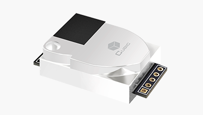

CUBIC CM1106 Single Beam NDIR CO2 Sensor Module
===============================================

.. seo::
    :description: Instructions for setting up CM1106 CO2 sensors
    :image: cm1106.png
    :keywords: cm1106, DAIKIN BRY88AB151K, BRY88AB151K

The ``cm1106`` sensor platform allows you to use CM1106 CO2 sensors with ESPHome.

    CUBIC CM1106 Single Beam NDIR CO2 Sensor Module.

As the communication with the CM1106 is done using UART, you need
to have an :ref:`UART bus <uart>` in your configuration with the ``rx_pin`` connected to the TX pin of the
CM1106 and the ``tx_pin`` connected to the RX Pin of the CM1106 (it's switched because the
TX/RX labels are from the perspective of the CM1106). Additionally, you need to set the baud rate to 9600.

.. code-block:: yaml

    # Example configuration entry
    sensor:
      - platform: cm1106
        co2:
          name: CM1106 CO2 Value

Configuration variables:
------------------------

- **co2** (**Required**): The CO2 data from the sensor in parts per million (ppm).
  All options from :ref:`Sensor <config-sensor>`.

- **update_interval** (*Optional*, :ref:`config-time`): The interval to check the
  sensor. Defaults to ``60s``.

- **uart_id** (*Optional*, :ref:`config-id`): Manually specify the ID of the :ref:`UART Component <uart>` if you want
  to use multiple UART buses.

- **id** (*Optional*, :ref:`config-id`): Manually specify the ID used for actions.

.. _cm1106-calibrate_zero_action:

``cm1106.calibrate_zero`` Action
--------------------------------

This :ref:`action <config-action>` executes zero point calibration command on the sensor with the given ID.

If you want to execute zero point calibration, the CM1106 sensor must work in stable gas environment (400ppm)
for over 20 minutes and you execute this function.

.. code-block:: yaml

    on_...:
      then:
        - cm1106.calibrate_zero: my_cm1106_id

You can provide an :ref:`action <api-device-actions>` to perform from Home Assistant

.. code-block:: yaml

    api:
      actions:
        - action: cm1106_calibrate_zero
          then:
            - cm1106.calibrate_zero: my_cm1106_id

.. _cm1106-abc_enable_action:

See Also
--------

- :ref:`sensor-filters`
- :apiref:`cm1106/cm1106.h`
- :ghedit:`Edit`
