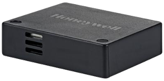
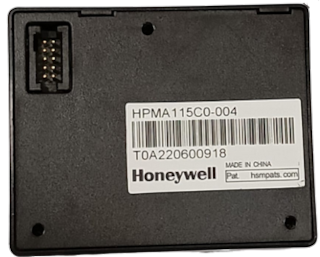
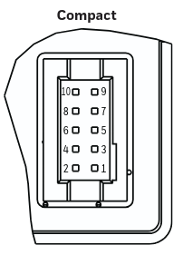
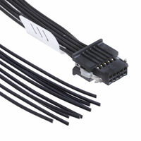
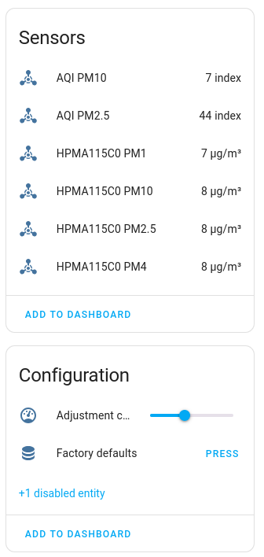

HPMA115C0 Particulate Matter Sensor
==================================================

.. seo::
    :description: Instructions for configuring the Honeywell HPMA115C0 Particulate matter sensor.
    :image: hpma115c0.png
    :keywords: hpma115c0

The ``hpma115c0`` sensor platform allows using the 
`Honeywell HPMA115C0 <https://prod-edam.honeywell.com/content/dam/honeywell-edam/sps/siot/en-us/products/sensors/partic
ulate-matter-sensors-hpm-series/documents/sps-siot-particulate-hpm-series-datasheet-32322550-ciid-165855.pdf>`__
with ESPHome Particulate matter (PM) sensor to measure PM concentrations in the air.

    Air outlet, intake is at opposite side (model -004).

    Connector.

Pinout:
-------

+-----+------+----------------------------------+
| Pin | Name | Description                      |
+=====+======+==================================+
|  1  | Vout | Power output (+5V), max. 300 mA) |
+-----+------+----------------------------------+
|  2  | Vcc  | Power input (+5V)                |
+-----+------+----------------------------------+
|  3  | GND  | Ground                           |
+-----+------+----------------------------------+
|  4  | GND  | Ground                           |
+-----+------+----------------------------------+
|  5  | RES  | Reserved for future use          |
+-----+------+----------------------------------+
|  6  | N/A  | N/A                              |
+-----+------+----------------------------------+
|  7  | Rx   | UART Rx input (0 V - 3.3 V)      |
+-----+------+----------------------------------+
|  8  | N/A  | N/A                              |
+-----+------+----------------------------------+
|  9  | TX   | UART Tx output (0 V - 3.3 V)     |
+-----+------+----------------------------------+
| 10  | SET  | Reserved for future use          |
+-----+------+----------------------------------+

.. warning::
   Although sensor is powered by +5V, UART pins 7 and 9 (**Tx** and **Rx**) are using **3.3V** voltage levels.

For easier connection, a ready-made pigtail connector with wires can be ordered from Samtech Inc :
reference **SFSD-05-28-H-05.00-SR**

Configuration:
--------------

.. code-block:: yaml

    # UART for HPMA115C0 sensor
    uart:
      baud_rate: 9600
      tx_pin: GPIOxx
      rx_pin: GPIOxx

    # Honeywell HPMA115C0
    hpma115c0:
      update_interval: 30s

    sensor:
      - platform: hpma115c0
        pm_1_0:
            name: "HPMA115C0 PM1 Value"
        pm_2_5:
            name: "HPMA115C0 PM2.5 Value"
        pm_4_0:
            name: "HPMA115C0 PM4 Value"
        pm_10_0:
            name: "HPMA115C0 PM10 Value"

Platform:
*********
- **uart_id** (*Optional*, :ref:`config-id`): Manually specify the ID of the :ref:`UART Component <uart>` if you want
  to use multiple UART buses.

- **update_interval** (*Optional*, :ref:`config-time`): Specify the polling frequency of sensor in seconds.

- **id** (*Optional*, :ref:`config-id`): Manually specify the ID used for actions.

.. code-block:: yaml

    hpma115c0:
        uart_id: HPMA_UART
        update_interval: 10s

Sensor:
*******

- **pm_1_0** (**Required**): Concentration of 1 µm PM in µg/m\ :sup:`3`
    All options from :ref:`Sensor <config-sensor>`.

- **pm_2_5** (**Required**): Concentration of 2.5 µm PM in µg/m\ :sup:`3`
    All options from :ref:`Sensor <config-sensor>`.

- **pm_4_0** (**Required**): Concentration of 4 µm PM in µg/m\ :sup:`3`
    All options from :ref:`Sensor <config-sensor>`.

- **pm_10_0** (**Required**): Concentration of 10 µm PM in µg/m\ :sup:`3`
    All options from :ref:`Sensor <config-sensor>`.

- **aqi_2_5** (*Optional*): Air Quality Index (AQI) for PM 2.5.
    Value is :ref:`derived <AQI-calculation>` from ``pm_2_5``.

- **aqi_10_0** (*Optional*): Air Quality Index (AQI) for PM 10.
    Value is :ref:`derived <AQI-calculation>` from ``pm_10_0``.

Button:
*******

*Optional* usage.

- **factory_reset** (**Required**): button for reseting sensor values to factory defaults. Currently resets the
  adjustment coefficient to 100.

  - All options from :ref:`Sensor <config-button>`.

.. code-block:: yaml

    button:
    - platform: hpma115c0
        factory_reset:
        name: "Factory reset"

Number:
*******

*Optional* usage.

- **adjustment_coefficient** (**Required**): Allows reading and changing the internal sensor adjustment coefficient.

Value in range  [30; 200], default value is 100. All options from :ref:`Number <config-number>`.

.. code-block:: yaml

    number:
    - platform: hpma115c0
        adjustment_coefficient:
        name : "Adjustement coefficient"

Component view:
***************

Sample component view in ESPHome interface :

See Also
--------

- :ref:`sensor-filters`
- :apiref:`hpma115c0/hpma115c0.h`
- :ghedit:`Edit`

References:
-----------

.. _AQI-calculation:

AQI calculations : see `this document <https://document.airnow.gov/technical-assistance-document-for-the-reporting-of-
daily-air-quailty.pdf#page=18>`__ from pages 13 to 15.