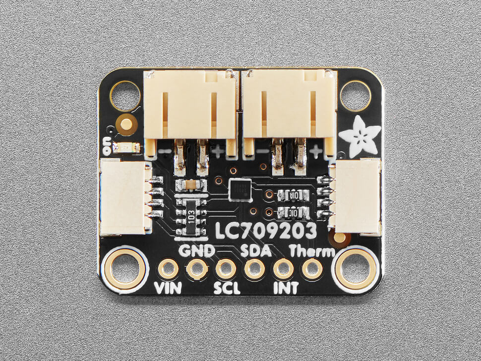
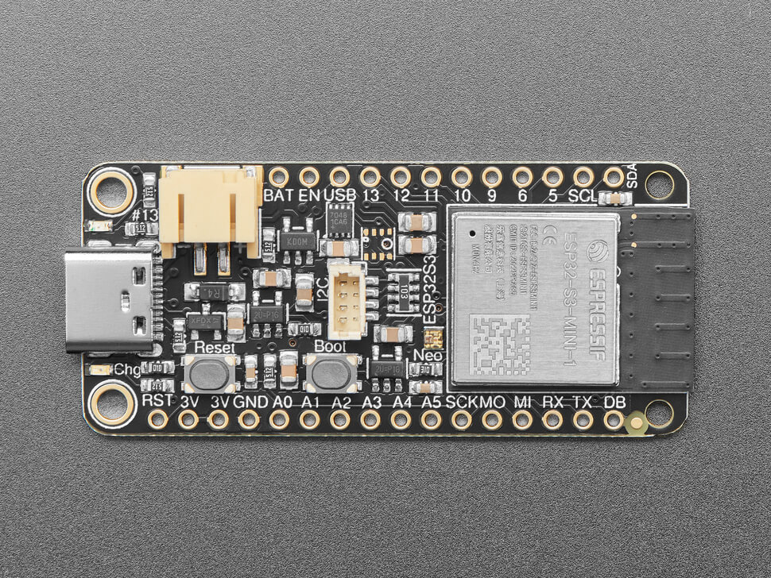
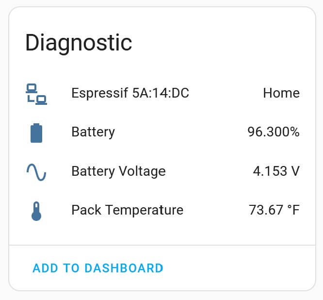
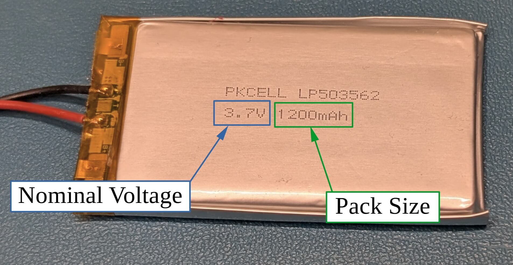
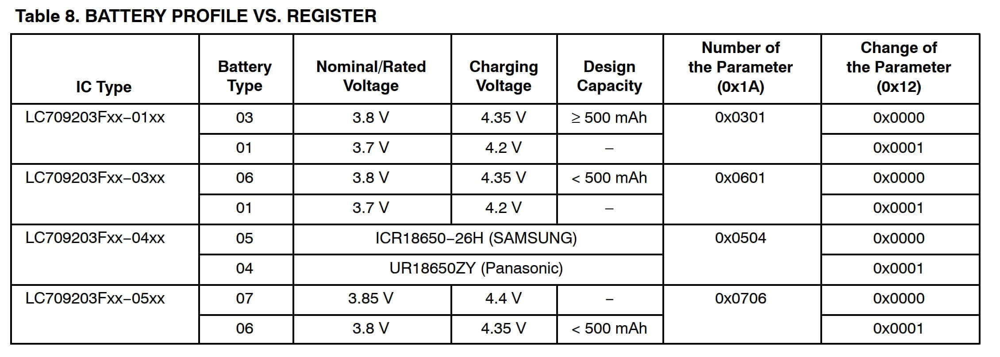
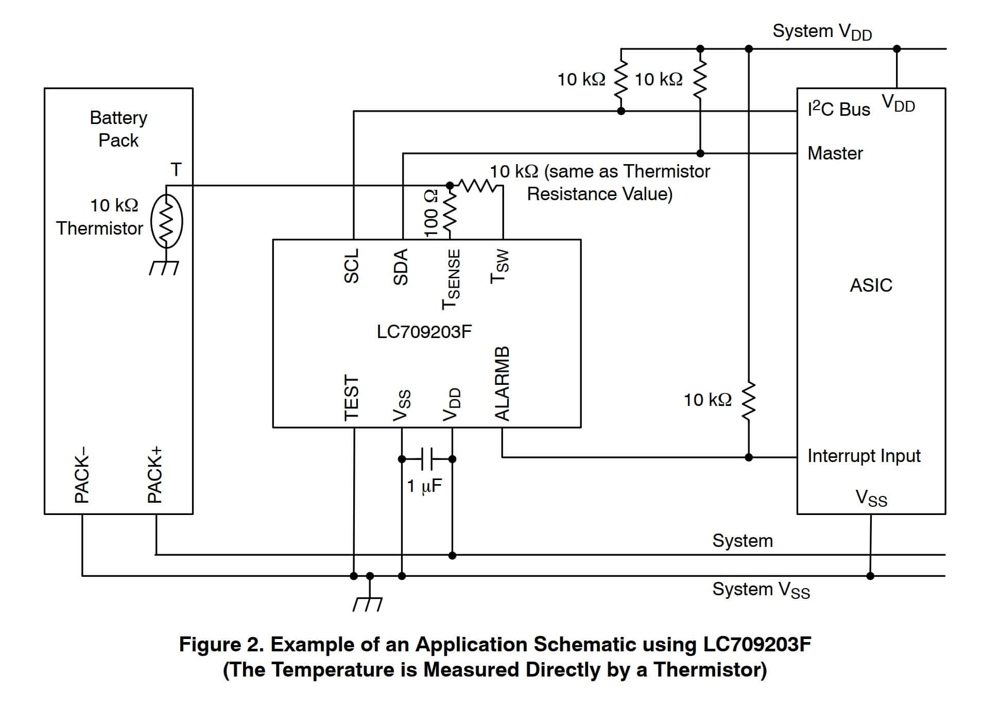

LC709203F Battery Monitor
===============================================

.. seo::
    :description: Instructions for setting up LC709203F battery monitor.
    :image: lc709203f.jpg
    :keywords: LC709203F

The ``lc709203f`` sensor platform allows you to use a LC709203F
(`datasheet <https://cdn-learn.adafruit.com/assets/assets/000/094/597/original/LC709203F-D.PDF>`__) 
battery monitor with ESPHome. This device is available as a 
`standalone sensor <https://www.adafruit.com/product/4712>`__ and it is also one of the battery
monitor chips used on their `ESP32 Feather <https://www.adafruit.com/product/5477>`__ dev boards.

    

.. note:: 

    This device does not contain a temperature sensor. Only enable the temperature sensor option 
    if you have attached a thermistor as shown in :ref:`temperature-sensor`.

Prerequisites:
------------------------

This component relies on the :ref:`I²C <i2c>` componenent to be setup. See the reference for
that component for details. A basic example of what that looks like is below.

.. code-block:: yaml

    i2c:
      sda: SDA
      scl: SCL
      scan: true
      id: bus_a

Configuration Example:
------------------------
An example configuration YAML is shown below.

.. code-block:: yaml

    sensor:
      - platform: lc709203f
        size: 2000
        voltage: 3.7
        battery_voltage:
          name: "Battery Voltage"
        battery_level:
          name: "Battery"
        temperature:
          name: "Pack Temperature"
          thermistor_b_constant: 0xA5A5

Configuration variables:
------------------------

- **size** (*Optional*): Size of the battery in mAH. 

  - Valid values are integers between 200 and 3000.
  - Defaults to 500 mAH.
  - see :ref:`pack-size-and-voltage` for help if you don't know your pack size.
  
- **voltage** (*Optional*): nominal voltage of the battery pack in V.

  - Valid values are ``3.7`` or ``3.8``
  - Defaults to ``3.7``. This is the correct value for the Adafruit batteries.
  - see :ref:`pack-size-and-voltage` for help if you don't know your pack voltage.
  - see :ref:`pack-voltage` for more information on how this value is used.

- **battery_voltage** (*Optional*): The setup information for the voltage sensor.

  - Standard options from :ref:`Sensor <config-sensor>`.
  - **name** (*Optional*): I suggest setting this one.
  
- **battery_level** (*Optional*): The setup information for the battery level sensor.

  - Standard options from :ref:`Sensor <config-sensor>`.
  - **name** (*Optional*): I suggest setting this one.

- **temperature** (*Optional*): The setup information for the battery temperature sensor.
  
  - **thermistor_b_constant** (*Optional*): The B-constant of the thermistor. Defaults 
    to `0x0BA6` but if you are using a thermistor, you should really change this.
  - Standard options from :ref:`Sensor <config-sensor>`.
  - **name** (*Optional*): I suggest setting this one.

- **update_interval** (*Optional*, :ref:`config-time`): The interval to check the
  sensor. Defaults to ``60s``.

Home Assistant View:
------------------------

When properly set up, the sensor will report values to Home Assistant as shown:

    :align: center
    :width: 80.0%

.. _pack-size-and-voltage:

Pack Size and Nominal Voltage
--------------------

If you don't know the pack size and nominal voltage of your battery, it is typically written
on the battery as shown below.

    :align: center
    :width: 80.0%

.. _pack-voltage:

Pack Voltage
--------------------

When setting up the device. You will need to set the nominal pack voltage of the device. This 
is used internally to make the sensor more accurate. The nominal voltage is used to set the 
``change of the parameter`` register per table 8 in the datasheet.

    :align: center
    :width: 80.0%

We assume that the device is a ``-01`` or ``-03`` device. This is the correct setup for the
Adafruit sensors and batteries.

.. _temperature-sensor:

Temperature Sensor Information
--------------------

If you want to measure temperature of the battery, you **must** have a thermistor attached to 
the device as shown in figure 2 of the datasheet.

Special Thanks
--------

Special thanks to the authors and contributors for the MAX17043 and BME680 sensor components
that I used extensivly to learn how to create this component.
