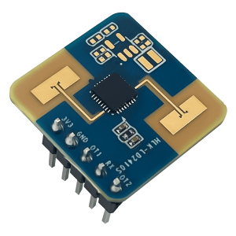

LD2410s Sensor
==============

.. seo::
    :description: Instructions for setting up LD2410s sensors.
    :image: ld2410s.png

The ``LD2410s`` sensor platform allows you to use HI-LINK LD2410s motion and presence sensors with ESPHome.

    LD2410s motion and presence sensor  

Module provides auto-calibration which doesn't always produce perfect results.
You can use Factory Reset to load default calibration, or manually calibrate values Threshold, Hold and SNR for each one of 16 gates.

You can enable energy values reading for gates by disabling Minimal output.

.. list-table:: Module Pinouts
    :widths: 25 25 25
    :header-rows: 1

    * - Pin#
      - Name
      - Function
    * - 1
      - 3v3
      - VCC 3.0~3.6V
    * - 2
      - GND
      - GND
    * - 3
      - OT1
      - Serial Tx (to ESP Rx)
    * - 4
      - RX
      - Serial Rx (to ESP Tx)
    * - 5
      - OT2
      - Presence Signal Output

Component
---------
.. _ld2410s-component:

.. code-block:: yaml

    ld2410s:
    uart_id: uart_bus

Configuration variables:
************************

- **uart_id** (*Optional*, :ref:`config-id`): Manually specify the ID of the :ref:`UART Component <uart>` to use.
  Required if you have multiple UARTs configured.

UART
----
.. _ld2410s-uart:

The :ref:`UART <uart>` is required to be set up in your configuration for this sensor to work, ``baud_rate``, ``parity`` and ``stop_bits``  **must be** respectively ``115200``, ``NONE`` and ``1``.

.. code-block:: yaml

    uart:
      id: uart_bus
      tx_pin: GPIO17
      rx_pin: GPIO16
      baud_rate: 115200
      parity: NONE
      stop_bits: 1

Binary Sensor
-------------
.. _ld2410s-binary-sensors:

The ``ld2410s`` binary sensor offers presence state for the targets.

.. code-block:: yaml

    binary_sensor:
    - platform: ld2410s
      has_target:
        name: Presence
      has_threshold_update:
        name: Threshold update running

Configuration variables:
************************

- **has_target** (*Optional*): 
  True if either target is still or in movement.
  All options from :ref:`Binary Sensor <config-binary_sensor>`.
- **has_threshold_update** (*Optional*): 
  True if sensor auto-calibration is in progress.
  All options from :ref:`Binary Sensor <config-binary_sensor>`.

Sensor
-------------
.. _ld2410s-sensors:

The ``ld2410s`` binary sensor offers target distance.

.. code-block:: yaml

    sensor:
    - platform: ld2410s
      target_distance:
        name: Target Distance
      threshold_update:
        name: Threshold update progress

Configuration variables:
************************

- **target_distance** (*Optional*): 
  Detected target distance.
  All options from :ref:`Sensor <config-sensor>`.
- **threshold_update** (*Optional*): 
  Auto-calibration progress status.
  All options from :ref:`Sensor <config-sensor>`.

Text Sensor
-------------
.. _ld2410s-text-sensors:

The ``ld2410s`` text sensor offers diagnostic and calibration data.

.. code-block:: yaml

    text_sensor:
    - platform: ld2410s
      fw_version:
        name: Firmware version
      trigger_threshold_ts:
        name: Triggers Threshold
      trigger_hold_ts:
        name: Triggers Hold
      trigger_snr_ts:
        name: Triggers SNR
      energy_values_ts:
        name: Energy Values

Configuration variables:
************************

- **fw_version** (*Optional*): 
  Specifies LD2410s firmware version.
  All options from :ref:`Text Sensor <config-text_sensor>`.
- **trigger_threshold_ts** (*Optional*): 
  Reports threshold calibration values for all gates. 
  Useful for diagnostic and fine tuning.
  All options from :ref:`Text Sensor <config-text_sensor>`.
- **trigger_hold_ts** (*Optional*): 
  Reports hold  calibration values for all gates. 
  Useful for diagnostic and fine tuning.
  All options from :ref:`Text Sensor <config-text_sensor>`.
- **trigger_snr_ts** (*Optional*): 
  Reports SNR  calibration values for all gates. 
  Useful for diagnostic and fine tuning.
  All options from :ref:`Text Sensor <config-text_sensor>`.
- **energy_values_ts** (*Optional*): 
  Reports energy values for all gates. 
  Updates only if Mininal Updades is disabled.
  All options from :ref:`Text Sensor <config-text_sensor>`.

Number
-------------
.. _ld2410s-number:

.. code-block:: yaml

    number:
    - platform: ld2410s
      max_distance:
        name: Max detect distance
      min_distance:
        name: Min detect distance
      no_delay:
        name: No detect report delay
      status_reporting_frequency:
        name: Status reporting frequency
      distance_reporting_frequency:
        name: Distance reporting frequency

      trigger_selected_gate:
        name: Trigger Selected Gate
      trigger_threshold:
        name: Trigger Gate Threshold
      trigger_hold:
        name: Trigger Gate Hold
      trigger_snr:
        name: Trigger Gate SNR

Configuration variables:
************************

- **max_distance** (*Optional*): 
  Maximum detection distance.
  Valid range is 0.5~8 m.
  All options from :ref:`Number <config-number>`.
- **min_distance** (*Optional*): 
  Minimum detection distance.
  Valid range is 0~8 m.
  All options from :ref:`Number <config-number>`.
- **no_delay** (*Optional*): 
  No detection delay.
  Valid range is 0~120 s.
  Specifies how long will ``has_target`` binary sensor be True after the last movement or presence detection.
  All options from :ref:`Number <config-number>`.
- **status_reporting_frequency** (*Optional*): 
  Frequency for ``has_target`` binary sensor reporting.
  Valid range is 0.5~8 Hz.
  All options from :ref:`Number <config-number>`.
- **distance_reporting_frequency** (*Optional*): 
  Frequency for ``target_distance`` sensor reporting.
  Valid range is 0.5~8 Hz.
  All options from :ref:`Number <config-number>`.

- **trigger_selected_gate** (*Optional*): 
  Selects gate (0-15) to setup calibration values.
  All options from :ref:`Number <config-number>`.
- **trigger_threshold** (*Optional*): 
  Configures selected gate Threshold calibration value.
  Valid range is 10~95 dB.
  All options from :ref:`Number <config-number>`.
- **trigger_hold** (*Optional*): 
  Configures selected gate Hold calibration value.
  Valid range is 10~95 dB.
  All options from :ref:`Number <config-number>`.
- **trigger_snr** (*Optional*): 
  Configures selected gate SNR calibration value.
  Valid range is 5~63 dB.
  All options from :ref:`Number <config-number>`.

Button
-------------
.. _ld2410s-button:

.. code-block:: yaml

    - platform: ld2410s
      write_all:
        name: Apply config changes
      read_all:
        name: Read configuration
      factory_reset:
        name: Factory reset
      calibration:
        name: Start auto calibration
      minimal_output:
        name: Toggle minimal output

Configuration variables:
************************

- **write_all** (*Optional*): 
  Saves all calibration values.
  All options from :ref:`Button <config-button>`.
  Component is already saving every parameter modification so explicit saving is not really needed. Option remains for diagnostic puropose.
- **read_all** (*Optional*): 
  Re-read all configuration values.
  All options from :ref:`Button <config-button>`.
  Component is already reading all parameters on startup so explicit loading is not really needed. Option remains for diagnostic puropose.
- **factory_reset** (*Optional*): 
  Reset all configuration values to suggested default values.
  All options from :ref:`Button <config-button>`.
  Please note that factory reset set everything in a way that HLT Tech tool  dies which may not produce good results. Use it only if really neccesary.
- **calibration** (*Optional*): 
  Initiates auto-calibration.
  All options from :ref:`Button <config-button>`.
  Please note that auto-calibration may not produce good results. Use it only if really neccesary.
- **minimal_output** (*Optional*): 
  Toggles minimal output. 
  By default minimal value is enabled, but you can disable it which will provide ``energy_values_ts`` readings.
  All options from :ref:`Button <config-button>`.

Before doing Factory reset or Calibration please backup existing settings:
  - Triggers Threshold
  - Triggers Hold
  - Trigger Gate SNR
That would allow you to restore your ld2410s to real factory default state.
Also, please provide those settings to me (https://github.com/NovakIrs) so that I could improve Factory reset settings.

Select
-------------
.. _ld2410s-select:

.. code-block:: yaml

    select:
    - platform: ld2410s
      response_speed:
        name: Response speed

Configuration variables:
************************

- **response_speed** (*Optional*): 
- **response_speed** (*Optional*): 
  Configures the sensor's response speed.
  All options from :ref:`Select <config-select>`.

Example configuration:
----------------------

Here is the complete example configuration for :doc:`ld2410s`.

.. code-block:: yaml

    esphome:
    name: esp32-ld2410s
    friendly_name: esp32-ld2410s

    esp32:
      board: esp32dev
      framework:
        type: arduino

    external_components:
      - source: github://NovakIrs/esphome@ld2410s
        components:
          - ld2410s

    wifi:
      networks:
        - ssid: !secret wifi_ssid
          password: !secret wifi_password
      ap:
        ssid: !secret ap_ssid
        password: !secret ap_password

    ota:
      - platform: esphome
        password: !secret ota_password

    api:
      encryption:
        key: !secret api_encryption_key

    logger:

    uart:
      id: uart_bus
      tx_pin: GPIO17
      rx_pin: GPIO16
      baud_rate: 115200
      parity: NONE
      stop_bits: 1

    ld2410s:
      uart_id: uart_bus

    sensor:
      - platform: ld2410s
        target_distance:
          name: Target Distance
        threshold_update:
          name: Threshold update progress

    binary_sensor:
      - platform: ld2410s
        has_target:
          name: Presence
        has_threshold_update:
          name: Threshold update running

    text_sensor:
      - platform: ld2410s
        fw_version:
          name: Firmware version
        trigger_threshold_ts:
          name: Triggers Threshold
        trigger_hold_ts:
          name: Triggers Hold
        trigger_snr_ts:
          name: Triggers SNR
        energy_values_ts:
          name: Energy Values

    number:
      - platform: ld2410s
        max_distance:
          name: Max detect distance
        min_distance:
          name: Min detect distance
        no_delay:
          name: No detect report delay
        status_reporting_frequency:
          name: Status reporting frequency
        distance_reporting_frequency:
          name: Distance reporting frequency
        trigger_threshold:
          name: Trigger Gate Threshold
        trigger_hold:
          name: Trigger Gate Hold
        trigger_snr:
          name: Trigger Gate SNR
        trigger_selected_gate:
          name: Trigger Selected Gate

    button:
      - platform: ld2410s
        write_all:
          name: Apply config changes
        read_all:
          name: Read configuration
        calibration:
          name: Start auto calibration
        factory_reset:
          name: Factory reset
        minimal_output:
          name: Toggle minimal output

    select:
      - platform: ld2410s
        response_speed:
          name: Response speed

See Also
--------

- Official documentation:
    - `Description <https://www.hlktech.net/index.php?id=1176>`_
    - `Official Datasheet and user manuals <https://drive.google.com/drive/folders/1wC8KC-DaNavNbpeVouZ1HdiBzZ9YrAcg>`_
- Source of inspiration for implementation:
    - `MrUndead1996 <https://github.com/MrUndead1996/ld2410s-esphome>`_
    - `ProjectZed <https://github.com/ProjectZed/ld2410s-esphome>`_
- :apiref:`ld2410s/ld2410s.h`
- :ghedit:`Edit`

