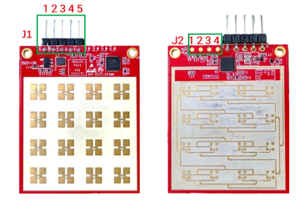

LD2413 Sensor
=============

.. seo::
    :description: Integration for the HLK-LD2413 mmWave liquid/material level sensor in ESPHome.
    :image: ld2413.jpg

The ``ld2413`` sensor allows you to integrate the Hi-Link HLK-LD2413 millimeter wave distance sensor with ESPHome using UART.

The HLK-LD2413 is a compact, high-precision 24GHz mmWave sensor with built-in AIoT radar chip and intelligent firmware, designed specifically for non-contact detection of liquid levels and material heights in both industrial and consumer applications.

It supports a detection range of **15 cm to 10 m** with an accuracy of **±3 mm**.

Pinout: J1
----------

.. list-table::
   :widths: 15 20 30 35
   :header-rows: 1

   * - Pin
     - Name
     - Function
     - Illustrate
   * - J1Pin1
     - 3V3
     - Power Input
     - 3.0 V~3.6 V, Typ. 3.3 V
   * - J1Pin2
     - GND
     - Grounding
     - -
   * - J1Pin3
     - OT1
     - UART_TX
     - 0~3.3V
   * - J1Pin4
     - RX
     - UART_RX
     - 0~3.3V
   * - J1Pin5
     - OT2
     - IO Port
     - 0~3.3V

Pinout: J2
----------

.. list-table::
   :widths: 15 20 30 35
   :header-rows: 1

   * - Pin
     - Name
     - Function
     - Illustrate
   * - J2Pin1
     - 3V3
     - Power Input
     - 3.0 V~3.6 V, Typ. 3.3 V
   * - J2Pin2
     - CLK
     - Clock signal
     - 0~3.3V
   * - J2Pin3
     - DIO
     - Data port
     - 0~3.3V
   * - J2Pin4
     - GND
     - Grounding
     - -

.. code-block:: yaml

    uart:
      rx_pin: GPIO16
      tx_pin: GPIO17
      baud_rate: 115200

    sensor:
      - platform: ld2413
        name: "LD2413 Distance"

Configuration variables:
------------------------

- **name** (**Required**, string): The name of the sensor.
- All other options from :ref:`Sensor <config-sensor>`.

See Also
--------

- :ref:`sensor-component`
- :ref:`uart`
