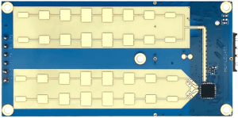

LD2451 Sensor
=============

Component/Hub
-------------
.. _ld2451-component:

The ``ld2451`` sensor platform allows you to use HI-LINK LD2451 vehicle speed and presence sensors with ESPHome.  It's supposed to handle 3 lanes of traffic and vehicles up to 100 meters away.  My testing shows it also detects people walking. It also connects to the HILINK App via bluetooth.

The :ref:`UART <uart>` is required to be set up in your configuration for this sensor to work, ``parity`` and ``stop_bits`` **must be** respectively ``NONE`` and ``1``.
Use of hardware UART pins is highly recommended, in order to support the out-of-the-box 256000 baud rate of the LD2451 sensor.

    LD2451 vehicle speed and presence sensor

.. code-block:: yaml

    # Example configuration entry
    ld2451:
      uart_id: uart_0
      throttle: 1000

Configuration variables:
************************

- **uart_id** (*Optional*, :ref:`config-id`): Manually specify the ID of the :ref:`UART Component <uart>` if you want
  to use multiple UART buses.
- **throttle** (*Optional*, int): Time in milliseconds to control the rate of data updates. Defaults to ``1000ms``.
- **id** (*Optional*, :ref:`config-id`): Manually specify the ID for this :doc:`ld2451` component if you need multiple components.

Sensor
------

The ``ld2451`` sensor allows you to use your :doc:`ld2451` to perform different
measurements.

.. code-block:: yaml

    sensor:
      - platform: ld2451
        target_angle:
          name: "Angle (degrees)"
        target_distance:
          name: "Distance (meters)"
        target_direction:
          name: "Direction (0=away,1=approach)"
        target_speed:
          name: "Speed (km/h)"
        target_snr:
          name: "Signal to noise ratio"

.. _ld2451-sensors:

Configuration variables:
************************

- **target_angle** (*Optional*, int): Actual angle value reported value - 0x80
  Value between ``1`` and ``255`` inclusive.
  All options from :ref:`Sensor <config-sensor>`.
- **target_distance** (*Optional*, int): Target distance (meters)
  Value between ``0`` and ``100`` inclusive.
  All options from :ref:`Sensor <config-sensor>`.
- **target_direction** (*Optional*, int): Target direction 0: Move away, 1: Approach
  Value between ``0`` and ``1`` inclusive.
  All options from :ref:`Sensor <config-sensor>`.
- **target_speed** (*Optional*, int): Target speed (km/h)
  Value between ``0`` and ``120`` inclusive.
  All options from :ref:`Sensor <config-sensor>`.
- **target_snr** (*Optional*, int): Target signal to noise ration.
  Value between ``0`` and ``255`` inclusive.
  All options from :ref:`Sensor <config-sensor>`.

Switch
------

The ``ld2451`` switch allows you to control your :doc:`ld2451`.

.. code-block:: yaml

    switch:
      - platform: ld2451
        bluetooth:
          name: "control bluetooth"

.. _ld2451-engineering-mode:

Configuration variables:
************************

- **bluetooth** (*Optional*): Turn on/off the bluetooth adapter. Defaults to ``true``.
  All options from :ref:`Switch <config-switch>`.
- **ld2451_id** (*Optional*, :ref:`config-id`): Manually specify the ID for the :doc:`ld2451` component if you are using multiple components.

.. _ld2451-number:

Number
------

The ``ld2451`` number allows you to control the configuration of your :doc:`ld2451`.

.. code-block:: yaml

    number:
      - platform: ld2451
        effective_trigger_time:
          name: Effective trigger time
        snr_threshold_level:
          name: SNR threshold level
        max_detect_distance:
          name: Max detection distance
        min_speed:
          name: Minimum speed
        no_target_timeout:
          name: No target delay time

Configuration variables:
************************

- **effective_trigger_time** (*Optional*, int): The alarm information will be reported only when the number of consecutive detections is met.
  Value between ``1`` and ``10`` inclusive.
  All options from :ref:`Number <config-number>`.
- **snr_threshold_level** (*Optional*, int): The larger the value, the lower the sensitivity and the more difficult it is to detect the target.
  Value between ``3`` and ``8`` inclusive.
  All options from :ref:`Number <config-number>`.
- **max_detect_distance** (*Optional*, int): Maximum detection distance (meters)
  Value between ``10`` and ``255`` inclusive.
  All options from :ref:`Number <config-number>`.
- **min_speed** (*Optional*, int): Minimum movement speed (km/h)
  Value between ``0`` and ``120`` inclusive.
  All options from :ref:`Number <config-number>`.
- **no_target_timeout** (*Optional*, int): No target delay time setting (seconds). If target is detected, it will delay notification (retriggerable).
  Value between ``0`` and ``255`` inclusive.
  All options from :ref:`Number <config-number>`.

Button
------

The ``ld2451`` button allows you to perform actions on your :doc:`ld2451`.

.. code-block:: yaml

    button:
      - platform: ld2451
        factory_reset:
          name: "factory reset"
        restart:
          name: "restart"
        query_params:
          name: query params

Configuration variables:
************************

- **factory_reset** (*Optional*): This command is used to restore all configuration values to their original values.
  All options from :ref:`Button <config-button>`.
- **restart** (*Optional*): Restart the device.
  All options from :ref:`Button <config-button>`.
- **query_params** (*Optional*): Refresh all sensors values of the device.
  All options from :ref:`Button <config-button>`.
- **ld2451_id** (*Optional*, :ref:`config-id`): Manually specify the ID for the :doc:`ld2451` component if you are using multiple components.

Text Sensor
-----------

The ``ld2451`` text sensor allows you to get information about your :doc:`ld2451`.

.. code-block:: yaml

    text_sensor:
      - platform: ld2451
        version:
          name: "firmware version"
        mac_address:
          name: "mac address"

Configuration variables:
************************

- **version** (*Optional*): The firmware version.
  All options from :ref:`Text Sensor <config-text_sensor>`.
- **mac_address** (*Optional*): The bluetooth mac address. Will be set to ``unknown`` when bluetooth is off.
  All options from :ref:`Text Sensor <config-text_sensor>`.
- **ld2451_id** (*Optional*, :ref:`config-id`): Manually specify the ID for the :doc:`ld2451` component if you are using multiple components.

Select
-----------

The ``ld2451`` select allows you to control your :doc:`ld2451`.

.. code-block:: yaml

    select:
      - platform: ld2451
        move_direction:
          name: Move direction

Configuration variables:
************************

- **move_direction** (*Optional*, int): Movement direction setting (0: Only detect away, 1: Only detect approach, 2: All detected)
  Value between ``0`` and ``2`` inclusive.
  All options from :ref:`Select <config-select>`.

Automations
-----------

``bluetooth_password.set`` Action
*********************************

This is an :ref:`Action <config-action>` for setting the bluetooth password.

.. code-block:: yaml

    - bluetooth_password.set:
        id: my_ld2451
        password: "HiLink"

Configuration variables:

- **id** (**Required**, :ref:`config-id`): The ID of the :doc:`ld2451` component to set.
- **password** (**Required**, string, :ref:`templatable <config-templatable>`):
  The password to set. Case sensitive. Must be exactly 6 characters long. Default password is ``HiLink``.

To change the password from HA you can use the following example config:

.. code-block:: yaml

    ld2451:
      uart_id: uart_0
      throttle: 1000
      id: my_ld2451

    api:
      actions:
        - action: set_ld2451_bluetooth_password
          variables:
            password: string
          then:
            - bluetooth_password.set:
                id: my_ld2451
                password: !lambda 'return password;'

See Also
--------

- `Source of inspiration for implementation <https://github.com/esphome/esphome/blob/dev/esphome/components/ld2410>`_
- :apiref:`ld2451/ld2451.h`
- :ghedit:`Edit`
