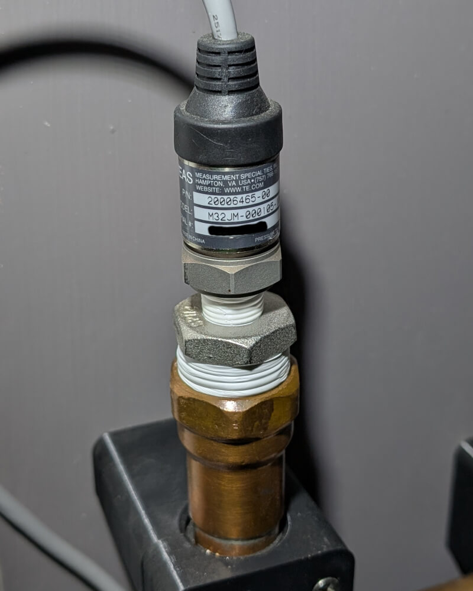
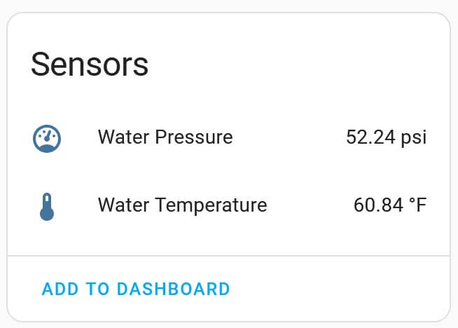
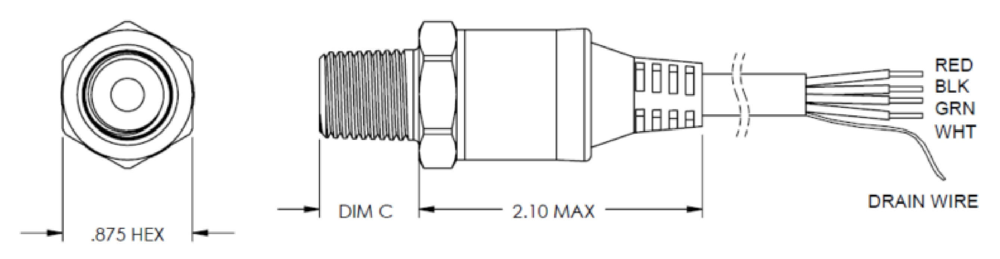

M3200 Battery Monitor
===============================================

.. seo::
    :description: Instructions for setting up M3200 pressure sensor.
    :image: m3200.jpg
    :keywords: M3200

The ``M3200`` sensor platform allows you to use a M3200 
(`Vendor site <https://www.te.com/en/product-CAT-PTT0068.html>`__) 
pressure sensor with ESPHome. This sensor is available in various pressure ranges and contains a temperature sensor.

.. note::

    This software may work with other TE digital pressure sensors. It appears that a lot of their sensor share the same digital protocol, but I have not tested this.

Prerequisites:
-----------------------------------------

This component relies on the :ref:`I²C <i2c>` componenent to be setup. See the reference for
that component for details. A basic example of what that looks like is below.

.. code-block:: yaml

    i2c:
      sda: SDA
      scl: SCL
      scan: true

Configuration Example:
-----------------------------------------
An example configuration YAML is shown below.

.. code-block:: yaml

    sensor:
      - platform: m3200
        full_scale_pressure: 100
        pressure_type: GAGE
        temperature:
          name: "M3200 Temperature"
        pressure:
          name: "M3200 Pressure"

Configuration variables:
-----------------------------------------

- **full_scale_pressure** (*required*): The full scale pressure of the sensor in psi

  - Valid values are integers between 10 and 6000.
  
- **pressure_type** (*required*): Is this a gage or a compound pressure sensor?

  - Valid values are ``GAGE``, ``GAUGE``, and ``COMPOUND``
  - This defines the minimum pressure of your sensor. 
  - Gage pressure sensors read 0 at atmospheric pressure
  - Compound sensors read down to 0 psia (vacuum)

- **update_interval** (*Optional*, :ref:`config-time`): The interval to check the
  sensor. Defaults to ``60s``.

Home Assistant View:
-----------------------------------------

When properly set up, the sensor will report values to Home Assistant as shown:

.. _sensor_setup:

Sensor wiring and install
-----------------------------------------

The details of how to wire up and install the sensor is beyond the scope of this document. However, I have put a few notes below to get you started.

The sensor comes with an integral cable. The wires can be identified by color:

    
  - Red: V+ (2.7 - 5 V)
  - Black: Ground
  - White: SCL
  - Green: SDA

If you are looking for a connector to use with this sensor, I have had good luck with the `Hirose LF <https://www.digikey.com/en/products/detail/hirose-electric-co-ltd/LF07WBP-6P-31/9171027>`__ connectors for being sturdy but not obnoxiusly expensive.
