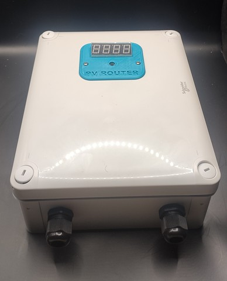

Telemetry from Mk2PVRouter diverter.
==============================================

.. seo::
    :description: Instructions for setting up Mk2PVRouter Telemetry
    :image: mk2pvrouter.jpg
    :keywords: mk2pvrouter

Component/Hub
-------------

The ``mk2pvrouter`` component allows you to retrieve data from a
Mk2PVRouter diverter using Telemetry. It works with any Mk2PVRouter
diverter, as long as this feature has been activated on the router itself.

    Mk2PVRouter diverter.

..

A simple electronic assembly with an ESP8266 or ESP32 could
let you retrieve detailed telemetry data from the diverter.

As the communication with the Telemetry is done using UART, you need to
have an :ref:`UART bus <uart>` in your configuration with the ``rx_pin``
connected to the output of the diverter. Additionally, you need to
set the baud rate to 9600bps.

.. code-block:: yaml

    # Example configuration entry
    mk2pvrouter:
      update_interval: 5s

Configuration variables:
------------------------

In ``mk2pvrouter`` platform:

- **update_interval** (*Optional*, :ref:`config-time`): The interval to check the
  sensor. Defaults to ``60s``.

Sensor
******

.. code-block:: yaml

    sensor:
      - platform: mk2pvrouter
        tag_name: "P"
        name: "Power at grid"
        unit_of_measurement: "Wh"
        icon: mdi:flash
      - platform: mk2pvrouter
        tag_name: "D"
        name: "Diverted power"
        unit_of_measurement: "Wh"
        icon: mdi:flash
      - platform: mk2pvrouter
        tag_name: "E"
        name: "Diverted energy"
        unit_of_measurement: "Wh"
        icon: mdi:lightning-bolt

- **tag_name** (**Required**, string): Specify the tag you want to retrieve from the Telemetry. 

  .. note::

      The available tags are defined in the Mk2PVRouter diverter's program and depend on its configuration.
      Please refer to your diverter's documentation or configuration to determine the tags available for your setup.

- All other options from :ref:`Sensor <config-sensor>`.

Binary Sensor
*************

.. code-block:: yaml

    binary_sensor:
      - platform: mk2pvrouter
        tag_name: "R1"
        name: "Relay 1"

- **tag_name** (**Required**, string): Specify the tag you want to retrieve from the Telemetry.
- All other options from :ref:`Sensor <config-sensor>`.

Text Sensor
***********

.. code-block:: yaml

    text_sensor:
      - platform: teleinfo
        tag_name: "P"
        name: "Power at grid as string"

- **tag_name** (**Required**, string): Specify the tag you want to retrieve from the Telemetry.
- All other options from :ref:`Text Sensor <config-text_sensor>`.

See Also
--------

- :apiref:`mk2pvrouter/mk2pvrouter.h`
- :ghedit:`Edit`
