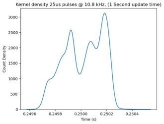

Pulse Width Sensor
==================

.. seo::
    :description: Instructions for setting up pulse width accumulation sensors 
    in ESPHome to measure total on-time of GPIO inputs for MOSFETs and TRIACs

The ``pulse_width_accumulate`` sensor allows you to sum the total on-time of 
a GPIO input. For example, this can be used to externally measure the total on-time 
of a rapidly switched MOSFET or TRIAC. The sensor zeros itself every polling 
interval.  Units of measurement are on-time seconds per update interval.
This sensor offers very similar functionality and performance to the ``duty cycle``, 
and ``pulse counter`` sensors, but uses the same GPIO.

.. Note::

    Threshold stability values on an ESP32 DevKit-v4:
   - Minimum pulse width: 25 µs
   - Minimum pulse width delay: 75 µs
   - Maximum implied frequency: ~10 kHz
   - Maximum pulse width: infinite 
   - Maximum polling time: ~71 minutes (see text below) 
   - Minimum polling time: 1 second        

.. code-block:: yaml

    # Example configuration entry
    sensor:
      - platform: pulse_width_accumulate
        pin: GPIO32
        name: Cumulative on-time sensor
        frequency:
          name: Average frequency sensor

.. note::

  Important implementation details:

  1. Edge interrupts, and the polling function both reset the microsecond 
  counter preventing overflow at 71.58 minutes. 
  2. Sensor accuracy is determined by the input signal frequency, for example: 
    - Test Condition #1 (25 µs pulses, 75 µs delay, 1 sec polling, 20379 samples):
      * Frequency. Expected 10 kHz. Observed mean 9998.2 Hz. Standard deviation=0.9 Hz
      * On-time. Expected based on time stamps 5094.25 s. Observed 5094.87 s (see figure below)
    - Test Condition #2 (300 µs pulses, 300 µs delay, 1 sec polling, 15333 samples):
      * Frequency, expected 1666.67 Hz, Observed mean 1666.57 Hz, standard deviation=0.50 Hz
      * On-time. Expected based on time stamps 7666 s. Observed 7665.97 s  
    - Test Condition #3 (random 1s to 10 min pulses, random 1 s to 1 min delay, 1 min polling, XX samples):
      * On-time. Expected based on generation algorithm output 18404.0 s. Observed 18405.0 s (gen algo used inaccurate millis() function)

      

Configuration variables:
------------------------

- **pin** (*Optional*, :ref:`Pin Schema <config-pin_schema>`): The pin to observe for the
  pulse width.
- **update_interval** (*Optional*, :ref:`config-time`): The interval to check the sensor.
  Defaults to ``60s``.

- **id** (*Optional*, :ref:`config-id`): Set the ID of this sensor for use in lambdas.
- All other options from :ref:`Sensor <config-sensor>`.

See Also
--------

- :ref:`sensor-filters`
- :doc:`/components/sensor/pulse_meter`
- :doc:`/components/sensor/pulse_counter`
- :doc:`/components/sensor/duty_cycle`
- :apiref:`pulse_width_accumulate/pulse_width_accumulate.h`
- :ghedit:`Edit`

