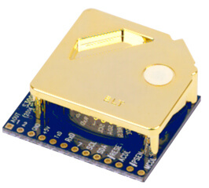

S300 CO₂ Sensor
===============

.. seo::
    :description: Instructions for setting up EST Sensors model S300 CO₂ Sensor
    :image: s300.jpg

The ``S300`` sensor platform allows you to use your EST Sensors S300 CO₂ sensors (`datasheet <https://gasdetect.com/wp-content/uploads/2014/08/DS_S-300_v2.2.pdf>`__) with ESPHome.
The :ref:`I²C Bus <i2c>` is required to be set up in your configuration for this sensor to work.

.. code-block:: yaml

    # Example configuration entry
    sensor:
      - platform: s300
        name: "Living Room CO2"

Configuration variables:
------------------------

- **address** (*Optional*, int): Manually specify the I²C address of the sensor.
  Defaults to ``0x31``.

- **update_interval** (*Optional*, :ref:`config-time`): The interval to check the
  sensor. Defaults to ``60s``.

- All other options from :ref:`Sensor <config-sensor>`.

See Also
--------

- :ref:`sensor-filters`
- :apiref:`s300/s300.h`
- `I2C Programming Guide <https://doc.switch-science.com/datasheets/ELT/Programming+Guide+for+I2C+cdg+ver+160714.pdf>`__
- :ghedit:`Edit`
