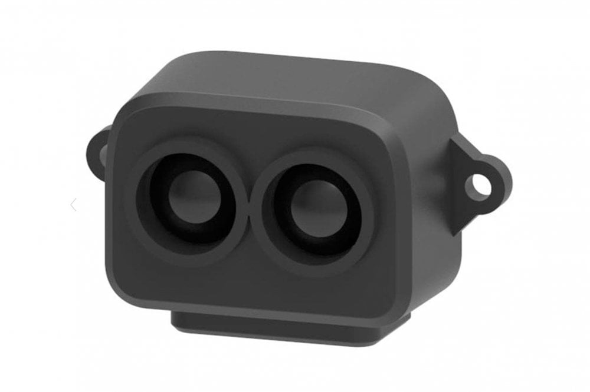

TF-Luna LiDAR Distance Sensor
=======================================

.. seo::
    :description: Instructions for setting up TF-Luna distance sensors in ESPHome.
    :image: tfluna.jpg
    :keywords: tfluna

Component/Hub
-------------
.. _tfluna-component:

The ``tfluna`` sensor platform allows you to use TF-Luna distance sensor (`datasheet <https://files.waveshare.com/upload/a/ac/SJ-PM-TF-Luna_A05_Product_Manual.pdf>`__)
with ESPHome to measure distances. The sensor works optically by emitting short infrared pulses
and measuring the time it takes the light to be reflected back.

The sensor can measure distances in range 20-800 centimeters, though that figure depends significantly
on several conditions like surface reflectance, field of view, temperature etc. .

The :ref:`I²C Bus <i2c>` is
required to be set up in your configuration for this sensor to work.

    TF-Luna Time Of Flight Distance Sensor.

.. code-block:: yaml

    # Example configuration entry
    tfluna:

Configuration variables:
------------------------

- **update_interval** (*Optional*, :ref:`config-time`): The interval to check the
  sensor. Defaults to ``60s``.
- **address** (*Optional*, int): Manually specify the I^2C address of the sensor. Defaults to ``0x10``.
- All other options from :ref:`Sensor <config-sensor>`.

Sensor
------

The ``tfluna`` sensor allows you to use your :doc:`tfluna` to perform different
measurements.

.. code-block:: yaml

    sensor:
      - platform: tfluna
        distance:
          name: Distance
        signal_strength:
          name: Signal Strength
        temperature:
          name: TF-Luna Temperature
        timestamp:
          name: TF-Luna Timestamp

.. _tfluna-sensors:

Configuration variables:
************************

- **distance** (*Optional*, int): Distance in cm.
  All options from :ref:`Sensor <config-sensor>`.
- **signal_strength** (*Optional*, int): Signal strength. If lower than 100, the range value is considered not reliable. If over 30000, there is an ambient light overexposure, for instance, when the sensor faces the sun outside.
  All options from :ref:`Sensor <config-sensor>`.
- **temperature** (*Optional*, float): Sensor temperature in degrees Celsius.
  All options from :ref:`Sensor <config-sensor>`.
- **timestamp** (*Optional*, float): Timestamp indicating milliseconds since the TF-Luna booted.
  All options from :ref:`Sensor <config-sensor>`.
- **tfluna_id** (*Optional*, :ref:`config-id`): Manually specify the ID for the :doc:`tfluna` component if you are using multiple components.

Button
------

The ``tfluna`` button allows you to perform actions on your :doc:`tfluna`.

.. code-block:: yaml

    button:
      - platform: tfluna
        factory_reset:
          name: "factory reset"
        restart:
          name: "restart"

Configuration variables:
************************

- **factory_reset** (*Optional*): This command is used to restore all configuration values to their original values.
  All options from :ref:`Button <config-button>`.
- **restart** (*Optional*): Restart the device.
  All options from :ref:`Button <config-button>`.
- **tfluna_id** (*Optional*, :ref:`config-id`): Manually specify the ID for the :doc:`tfluna` component if you are using multiple components.

Text Sensor
-----------

The ``tfluna`` text sensor allows you to get information about your :doc:`tfluna`.

.. code-block:: yaml

    text_sensor:
      - platform: tfluna
        version:
          name: "firmware version"

Configuration variables:
************************

- **version** (*Optional*): The firmware version.
  All options from :ref:`Text Sensor <config-text_sensor>`.
- **tfluna_id** (*Optional*, :ref:`config-id`): Manually specify the ID for the :doc:`tfluna` component if you are using multiple components.

See Also
--------

- :ref:`sensor-filters`
- :apiref:`tfluna/tfluna.h`
- :ghedit:`Edit`

