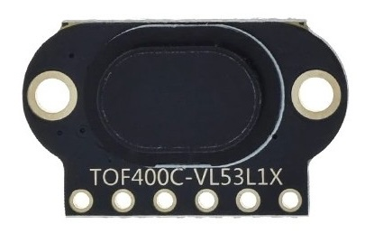

VL53L1X Time Of Flight Distance Sensor
======================================

.. seo::
    :description: Instructions for setting up VL53L1X distance sensors in ESPHome.
    :image: vl53l1x.jpg
    :keywords: VL53L1X

The ``vl53l1x`` sensor platform allows you to use VL53L1X optical time of flight
(`datasheet <https://www.st.com/resource/en/datasheet/vl53l1x.pdf>`__,
`ST <https://www.st.com/en/imaging-and-photonics-solutions/vl53l1x.html>`__) with ESPHome
to measure distances. The sensor works optically by emitting short infrared pulses
and measuring the time it takes the light to be reflected back

The sensor can measure distances up to 2 meters, though that figure depends significantly
on several conditions like surface reflectance, field of view, temperature etc. In general
you can expect surfaces up to 73cm to work, after that you need to make sure the surface is reflecting
well enough (see also section 3.5 of datasheet).

The :ref:`I²C Bus <i2c>` is required to be set up in your configuration for this sensor to work.

- ``VCC`` connects to 3V3 (``3V3`` will output 3.3V), or directly connect ``VCC`` to 3.3V
- ``GND`` connects to ground
- ``SCL`` connects I2C SCL (clock)
- ``SDA`` connects I2C SDA (data)
- ``GPIO1`` is not used by ESPHome
- ``XSHUT`` connects to a free GPIO pin. Enable/disable device. If there is only one
  VL53L1X sensor on the I²C bus and the default ``0x29`` address is used, you can
  connect this to ``VCC`` via a 10kΩ resistor.

.. code-block:: yaml

    # Simple configuration entry example
    sensor:
      - platform: vl53l1x
        name: "VL53L1x Distance"
        address: 0x29
        update_interval: 60s
        distance_mode: long

Configuration variables:
------------------------

- **update_interval** (*Optional*, :ref:`config-time`): The interval to check the
  sensor. Defaults to ``60s``.
- **distance_mode** (*Optional*): Set the distance mode. Long distance mode allows the longest possible ranging
  distance of 4 m to be reached. However, this maximum ranging distance is impacted by ambient light.
  Short distance mode is more immune to ambient light, but its maximum ranging distance is typically limited to
  1.3m. One of ``short``, ``medium``, or ``long``. Defaults to ``long``.
- **address** (*Optional*, int): Manually specify the i2c address of the sensor. Defaults to ``0x29``.
  If an address other the ``0x29`` is specified, the sensor will be dynamically re-addressed at startup.
  A dynamic re-address of sensor requires the ``enable_pin`` configuration variable to be assigned.
  If more then one VL53L1X sensor is used on the same i2c bus, a unique address must be specified per sensor.
- **enable_pin** (*Optional*, :ref:`Pin Schema <config-pin_schema>`): The pin connected to XSHUT
  on vl53l1x to enable/disable sensor. **Required** if not using address ``0x29`` which is the cause if you
  have multiple VL53L1X on the same i2c bus. In this case you have to assign a different pin to each VL53L1X.
- **timeout** (*Optional*, :ref:`config-time`): Sensor setup timeout. Default to ``50ms``.
- **region_of_interest** (*Optional*): The region of interest (ROI) is a rectangular area of the sensor's field
  of view that is used for ranging. The ROI is defined by its center coordinates (x, y) and its width and height.
  They are specified by the count of SPADs (Single Photon Avalanche Diodes) in the sensor's array. You can specify
  just the dimensions as *width* **x** *height* (e.g ``8x8``) or all fields with separate config keys.

  - **width** (*Required*, int): Width of the region of interest in SPADs. Range from 4 to 16. Default is 16.
  - **height** (*Required*, int): Height of the region of interest in SPADs. Range from 4 to 16. Default is 16.
  - **x_offset** (*Optional*, int): X offset of the region of interest in SPADs. Range from -7 to 8. Default is 0.
  - **y_offset** (*Optional*, int): Y offset of the region of interest in SPADs. Range from -7 to 8. Default is 0.

- **measurement_timing_budget** (*Optional*, :ref:`config-time`): Timing budget is how long it will take
  measurements to return a single reading. Increasing the timing budget increases the maximum distance the
  device can range and improves the repeatability error. However, average power consumption augments accordingly.
  The default ``50ms``, he minimum is ``20ms``, and the maximum is ``1000ms``.
- All other options from :ref:`Sensor <config-sensor>`.

.. code-block:: yaml

    # Muliple VL53L1X sensors on same i2c bus
    # Example configuration entry
    sensor:
      - platform: vl53l1x
        name: "distance1"
        id: distance1
        address: 0x41
        enable_pin: GPIOXX
        timeout: 200us
        update_interval: 500ms
        unit_of_measurement: "m"

      - platform: vl53l1x
        name: "distance2"
        id: distance2
        address: 0x42
        enable_pin: GPIOXX
        timeout: 200us
        update_interval: 500ms
        unit_of_measurement: "m"

See Also
--------

- :ref:`sensor-filters`
- :doc:`vl53l0x`
- :apiref:`vl53l1x/vl53l1x_sensor.h`
- `vl53l1x-arduino library <https://github.com/pololu/vl53l1x-arduino/>`__ by `Pololu <https://github.com/pololu>`__
- :ghedit:`Edit`
