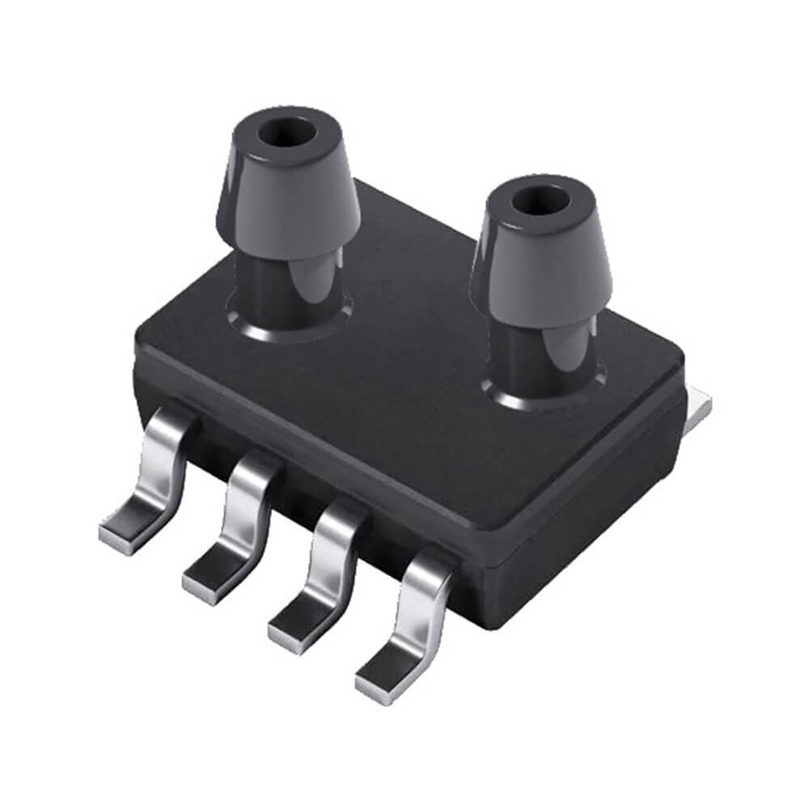

Sencoch Semiconductor GZP68xx / CFSensor XGZP68xx Series Differential Pressure Sensor
=====================================================================================

.. seo::
    :description: Instructions for setting up the CFSensor XGZP68xx Series Differential Pressure sensor.
    :image: 6897d.jpg
    :keywords: XGZP68xx, XGZP6897, XGZP6899, XGZP6899D, XGZP6897D, GZP6899, GZP68xx, GZP6897, GXP6899, GZP6897D, GXP6899D

The XGZP68xx Differential Pressure sensor allows you to use digital differential pressure sensors such as the 6899D or 
6897D Series sensors with ESPHome. They are made by the Chinese OEM Sencoch under the GZP68xxD P/N.
The sensors pressure ranges are specified in the datasheets.

Calibrating the sensor can be done by checking the value that is returned when
the ports are open to the air. This value should be 0. If it is not, you can use the offset option to correct the
reading. For example, if your sensor is reading -40Pa when the ports are disconnected, you can set the offset to 40.

    XGZP6897D Differential Pressure Sensor.
    (Credit: `CFSensor <https://cfsensor.net/i2c-differential-pressure-sensor-xgzp6897d/>`__, image cropped and compressed)

.. _Sparkfun: https://www.sparkfun.com/products/17874

To use the sensor, set up an :ref:`I²C Bus <i2c>` and connect the sensor to the specified pins.

.. code-block:: yaml

    # Example configuration entry
    # It uses a filter offset to calibrate the sensor
    sensor:
      - platform: xgzp68xx
        temperature:
            name: "Temperature"
        pressure:
            name: "Differential Pressure"
            filters:
                - offset: 40.5

Configuration variables:
------------------------

- **temperature** (*Optional*): All options from :ref:`Sensor <config-sensor>`.
- **pressure** (*Optional*): All options from :ref:`Sensor <config-sensor>`.
- **k_value** (*Optional*, int): The K value comes from the following table. Pressure is intrinsically an analog value, and these I2C digital sensors have an internal ADC to convert the signal.  The k-value is used to configure the algorithm used by the ADC to the range of pressure.  It will default to 4096 if not specified, which is appropriate for a sensor measuring a maximum pressure in the window of +/- 1-2 kPa.

.. code-block:: yaml

    measuring range of the sensor
            kpa           k 
       131 < P ≤ 262     32
        65 < P ≤ 131     64
        32 < P ≤ 65     128
        16 < P ≤ 32     256
         8 < P ≤ 16     512
         4 < P ≤ 8     1024
         2 ≤ P ≤ 4     2048
         1 ≤ P < 2     4096
             P < 1     8192

    So for example, when measuring -30~80kpa, P=80kpa and the k value is 64.
    

- **update_interval** (*Optional*, :ref:`config-time`): The interval to check the sensor. Defaults to ``60s``.

See Also
--------
- `esphome-pressure device <https://github.com/gcormier/esphome-pressure/>`__
- :ref:`sensor-filters`
- :apiref:`sdp3x/sdp3x.h`
- :ghedit:`Edit`
