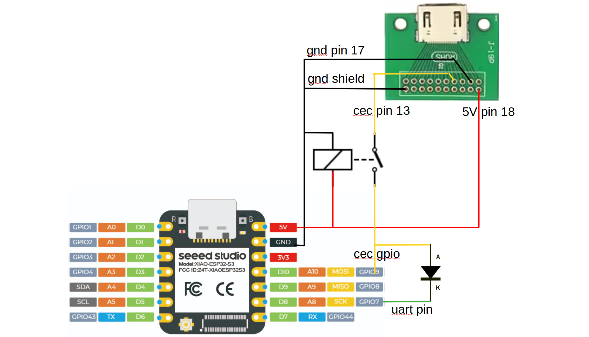
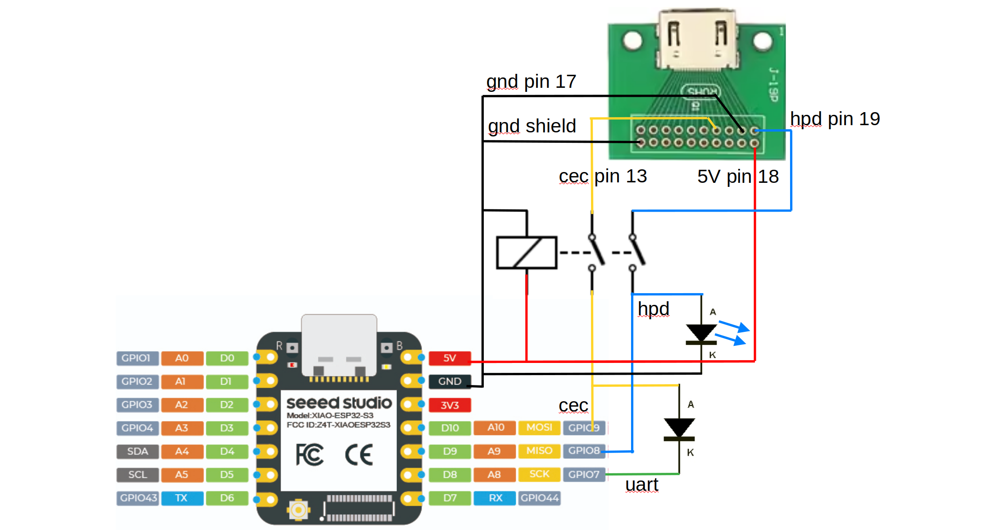

This component provides an implementation of the HDMI-CEC bus protocol, allowing to exchange commands with any device in a cluster
of HDMI-connected Audio/Video devices.

The HDMI-CEC (High-Definition Multimedia Interface - Consumer Electronics Control) is a single-wire bus
which is part of the standard HDMI cable, and is present as pin in any HDMI connector.
This bus is passed through all hdmi devices, and directly wired between all connectors in devices
like televisions, A/V-receivers, and HDMI switches. This bus is bidirectional and multi-master,
using 3.3V signals with a rather low bitrate.
Connecting one ESPHome microcontroller to single HDMI port on a TV,
allows to receive messages from and send messages to any device in the hdmi-connected cluster. Typical messages relate to
power-on and standby status, input selections, and audio volume control.

This software implementation on an ESPHome microcontroller allows to simply connect one GPIO pin to the CEC bus wire, HDMI pin 13.
However, see the remarks for a more robust (extensive) connection further below.

## Features

- The CEC protocol is implemented upto HDMI version 1.4. No external (third-party) CEC library is used.
- Actions to be taken on incoming messages can be specified in the yaml configuration by `on_message` triggers.
  In these triggers, messages can be matched on source, destination, opcode, and further arguments.
- Sending CEC messages can be specified in the yaml configuration with `hdmi_cec.send` actions.
  Furthermore, API calls `.send(...)` can be used in lambda sections.
- A few received message types are replied automatically through built-in handlers, which can be overridden if so desired.
- Debug logging shows all received and sent messages as hex byte sequence, and are now
  also annotated with a full textual decoding for better understanding and verification.
- New optional use of a UART can now resolve the issue of timing warnings in the esphome log output

On the to-do list is still "Automatic Physical Address Discovery" through E-DDC: This would allow
to automatically detect the CEC "source" address of this component.
For now, this must be entered as part of the configuration.

## Basic installation

Wire your ESPhome device to an HDMI connector (e.g. with an HDMI breakout board as can be found on Amazon) as follows:

- GPIO pin of your choice -> HDMI pin 13 (CEC)
- GND -> HDMI pin 17 (DDC/CEC ground)
- *Optional but recommended*: wire your board's 5V supply to HDMI pin 18. This is how your TV or Receiver
  on the other end knows something is connected and alive.

The CEC bus uses 3.3V logic, so it can be directly connected to a GPIO of ESP32/ESP8266 devices.
The GPIO pin mode will be set automatically by the software, to use a "weak pull-up" mode.
The selected pin should support this mode, but that is generally available.
Note, for extra robustness, the remarks below in [Extended installation](#extended-installation).

## Basic configuration

```yaml
hdmi_cec:
  id: cec
  # Pick a GPIO pin that can do both input AND output
  pin: GPIO9 # Required
  # The (logical) address can be anything in the [0x1 .. 0xF] range.
  # Use 0xF if you only want to listen to the bus and not act
  # like a standard device. Address 0x5 is for an audio device.
  address: 0xE # Required
  # Physical address of the device. In this case: 4.0.0.0 (HDMI4 input on the TV)
  # Unfortunately, you will have to set this manually.
  physical_address: 0x2000 # Required
  # The name that will be displayed in the list of devices on your TV/receiver
  osd_name: "my device" # Optional. Defaults to "esphome"
  # By default, promiscuous mode is disabled, so the component only handles
  # directly-addressed messages (matching the address configured above)
  # and broadcast messages. Enabling promiscuous mode will make the component
  # listen for ALL messages (both in logs and the 'on_message' triggers)
  promiscuous_mode: false # Optional. Defaults to false
  # By default, monitor mode is disabled, so the component can send messages and acknowledge incoming messages.
  # Enabling monitor mode lets the component act as a passive listener, disabling active manipulation of the CEC bus.
  monitor_mode: false # Optional. Defaults to false
  # By default, received and sent cec messages are decoded to text in the debug log output.
  # For resource-constrained applications, this decoding can be disabled:
  decode_messages: true # Optional. Defaults to true
  # List of triggers to handle specific commands. Each trigger has the following optional filter parameters:
  # - "source": match messages coming from the specified address
  # - "destination": match messages meant for the specified address
  # - "opcode": match messages bearing the specified opcode
  # - "data": vector of bytes to match on message content (or just its initial part), starting with opcode
  # Actions called from these triggers is called with "source", "destination" and "data" as parameters
  on_message:
    - opcode: 0x36 # opcode for "Standby"
      then:
        logger.log: "Got Standby command"

    # Respond to "Menu Request" (not required, example purposes only)
    - opcode: 0x8D
      then:
        hdmi_cec.send:
          # both "destination" and "data" are templatable
          destination: !lambda return source;
          data: [0x8E, 0x01] # 0x01 => "Menu Deactivated"
```

## Example: Power-down HDMI devices

```yaml
button:
  - platform: template
    name: "Turn everything off"
    on_press:
      hdmi_cec.send:
        # "source" can optionally be set, like if you want to spoof another device's address
        destination: 0xF # Broadcast to all hdmi devices
        data: [0x36] # "Standby" opcode
```

## Example: TV power-up and volume control

```yaml
button:
  - platform: template
    name: "TV Power On"
    on_press:
      - hdmi_cec.send:
          destination: 0x0  # to TV
          data: [0x44, 0x6D]  # UI command, "Power On"
  - platform: template
    name: "TV Volume Up"
    on_press:
      - hdmi_cec.send:
          destination: 0x0  # to TV
          data: [0x44, 0x41]  # UI command, "Volume Up"
  - platform: template
    name: "TV Volume Down"
    on_press:
      # as example, using the api: component.send( destination, {opcode, parameters..} )
      - lambda: !lambda |-
          id(cec).send(0x0, {0x44, 0x42});  // UI command, "Volume Down"
```

Note that these cec commands for TV control are well-defined.
However, some TVs might not respond properly as they might have an incomplete implementation.

When the device with this *hdmi_cec* and this example *yaml* is integrated in *Home Assistant*,
and the buttons are pressed while capturing a debug output, the log would show something like this:

```text
  [17:14:50][D][api.connection:1579]: Home Assistant 2025.6.1 (192.168.178.194) connected
  [17:15:16][D][button:010]: 'TV Volume Up' Pressed.
  [17:15:16][D][hdmi_cec:381]: Sending: E0:44:41 => SpecificUse to TV: <User Control Pressed>[Volume Up]
  [17:15:17][D][hdmi_cec:345]: Send frame success in 1 attempt
  [17:15:52][D][button:010]: 'TV Volume Up' Pressed.
  [17:15:52][D][hdmi_cec:381]: Sending: E0:44:41 => SpecificUse to TV: <User Control Pressed>[Volume Up]
  [17:15:52][D][hdmi_cec:345]: Send frame success in 1 attempt
  [17:16:06][D][button:010]: 'TV Volume Down' Pressed.
  [17:16:06][D][hdmi_cec:381]: Sending: E0:44:42 => SpecificUse to TV: <User Control Pressed>[Volume Down]
  [17:16:06][D][hdmi_cec:345]: Send frame success in 1 attempt
  [17:16:14][D][button:010]: 'Standby All' Pressed.
  [17:16:14][D][hdmi_cec:381]: Sending: EF:36 => SpecificUse to All: <Standby>
  [17:16:14][D][hdmi_cec:345]: Send frame success in 1 attempt
  [17:16:14][D][hdmi_cec:126]: Received: 5F:72:00 => AudioSystem to All: <Set System Audio Mode>[Off]
  [17:16:36][D][button:010]: 'TV Power On' Pressed.
  [17:16:36][D][hdmi_cec:381]: Sending: E0:44:6D => SpecificUse to TV: <User Control Pressed>[Power On Function]
  [17:16:36][D][hdmi_cec:345]: Send frame success in 1 attempt
  [17:16:37][D][hdmi_cec:126]: Received: 0F:84:00:00:00 => TV to All: <Report Physical Address>[0.0.0.0][TV]
  [17:16:38][D][hdmi_cec:126]: Received: 0F:87:08:00:46 => TV to All: <Device Vendor ID>[Sony]
  [17:16:40][D][hdmi_cec:126]: Received: 0E:83 => TV to SpecificUse: <Give Physical Address>
  [17:16:40][D][hdmi_cec:381]: Sending: EF:84:20:00:04 => SpecificUse to All: <Report Physical Address>[2.0.0.0][Playback Device]
  [17:16:40][D][hdmi_cec:345]: Send frame success in 1 attempt
  [17:16:41][D][hdmi_cec:126]: Received: 5F:84:30:00:05 => AudioSystem to All: <Report Physical Address>[3.0.0.0][Audio System]
  [17:16:41][D][hdmi_cec:126]: Received: 0E:46 => TV to SpecificUse: <Give OSD Name>
  [17:16:41][D][hdmi_cec:381]: Sending: E0:47:65:73:70:68:6F:6D:65 => SpecificUse to TV: <Set OSD Name>[esphome]
  [17:16:43][D][hdmi_cec:126]: Received: 0E:8F => TV to SpecificUse: <Give Device Power Status>
  [17:16:43][D][hdmi_cec:381]: Sending: E0:90:00 => SpecificUse to TV: <Report Power Status>[On]
```

An advanced yaml configuration can be used to create an hdmi *audio device*, and instruct the TV to enable its ARC (audio return channel). This causes the TV to mute its own audio, pass its own volume control over cec to this device, and send its digital audio as SPDIF through HDMI pin 14.

## Example: Create service for Home Assistant

```yaml
api:
  ...
  services:
    - service: hdmi_cec_send
      variables:
        cec_destination: int
        cec_data: int[]
      then:
        - hdmi_cec.send:
            destination: !lambda "return static_cast<unsigned char>(cec_destination);"
            data: !lambda |
              std::vector<unsigned char> charVector;
              for (int i : cec_data) {
                charVector.push_back(static_cast<unsigned char>(i));
              }
              return charVector;
```

## Extended installation

The basic configuration can be extended with further enhancements:

1. Disconnect from the cec line on power-down
1. Use a UART for sending messages
1. Connect the HDMI 'Hot Plug Detect' pin

The figure below shows a schematics with the first two enhancements, adding a relay (for 1.) and a diode (for 2.):



Note that the particular microcontroller type in this schematics is arbitrary,
feel free to select a type that fits your project requirements.

The merits of these two enhancements are discussed below.

### 1: Disconnect from cec on power-down

Although the cec line uses 3.3V logic, which is fine for GPIO, there is an issue when your esphome device is powered off.
In that case, the cec line is likely to stay at 3.3V, and a GPIO pin should NOT have a voltage above the microcontroller
power supply: such situation exceeds the device operating conditions.
Although in practice people often ignore this, it has the risk of:

- damaging your microcontroller
- disturbing the communication between the other hdmi devices

Therefor, the schematics above proposes to add a small relay that disconnects the GPIO from the cec line
when the power is switched off. The choice of relay type is not critical, but it is advised to use a
small-signal and compact relay type such as a TQ2-5V or a G6K-2P-5V.

### 2: Use a UART for sending messages

The *hdmi_cec* component receives messages by being triggered by interrupts on GPIO level changes,
and timing of the delays between those changes. That is fine: the interrupts are short-duration software functions.

However, in the basic configuration, *sending* messages is done by software that changes the GPIO output
with software delays in between to set pulse durations.
Unfortunately, due to the low bitrate of cec, sending a message keeps hold of the CPU for a long period.
This conflicts with the esphome operating system, which wants the components to return control more frequently.
As result, in the basic configuration, you will see in an output debug log many warnings like:

```text
  [W][hdmi_cec:239]: Component hdmi_cec took a long time for an operation (224 ms).
```

Many people ignore this, and their component seems to work fine. However, these warnings are likely to affect
the esphome device stability, and might easily interfere with for instance wifi operation and/or
cause an occasional crash and reboot.
To avoid this issue, this new version of `hdmi_cec` allows to alternatively use a hardware UART to send its messages.
Using a UART takes the workload off the CPU. Clearly, your microcontroller needs to have a UART available.
Typically, one UART is already in use for creating output logs, but a second is mostly available.
Sometimes, a microcontroller restricts the selection of UART output pins. Note that only a UART output
is needed. For instance, a tiny controller like an esp8266 does provide an extra output-only UART.

The UART output pin is used in addition to the earlier cec pin which remains in use for receiving messages.
The UART should operate in 'open drain' output mode for the cec bus. The yaml configuration file syntax allows to
configure such output pin mode for the UART, but that typically does NOT work! As work-around, the above schematics
adds a diode between the UART pin and the cec line. Any standard small-signal diode should work, such as types 1N4148, 1N914.
Schottky type diodes offer a smaller voltage drop, but a low-leakage type is needed such as BAT81.
Do NOT choose larger rectifier diodes, as those will have too high reverse leakage current.

To enable the UART with the hdmi_cec component, the yaml file must declare the UART,
and pass its `id` to the cec component. For example:

```yaml
uart:
  id: cec_uart
  tx_pin: GPIO7
  baud_rate: 115200

hdmi_cec:
  pin: GPIO9
  uart_id: cec_uart
  address: 0xE
  physical_address: 0x2000
```

The baudrate assignment is required for a UART, but its value is not important: it will be
re-assigned by the `hdmi_cec` component software.

**Note**: On several microcontrollers, especially the esp types from Espressif, one UART will output a log message during boot-up.
Potentially, that could interfere with the intended CEC bus usage. To prevent such interference, different options are available:
Use some 'strapping pin' to change the boot message mode, write an eFuse register, or select a different UART when available.
Please consult the device programming manual for details.
However, especially when choosing a relatively fast UART baud_rate, other devices on the CEC bus do not seem to be
bothered by the weird pattern.

### 3: Connect the HDMI Hot Plug Detect pin

A further HDMI signal which might be useful for your application is HPD (*Hot Plug Detect*), at HDMI pin 19.
Strictly speaking, this signal is not part of the CEC protocol, so you would not need this for the CEC commands.
The HPD signal allows to easily detect that the HDMI is plugged into or pulled out of a device (such as the TV).

The signal is connected to +5V with a 1K series-resistor in the TV, So, for todays 3.3V microcontrollers,
the signal needs to be limited to 3.3V. In the circuit diagram below, this is done by a LED connected to GND.
This should be a blue or white LED, as those have a higher forward voltage then red or green LEDs.
Using a (blue) LED for for this purpose is nice, as it gives a direct visual feedback when using your circuit
(in comparison with using a 3.3V zener diode, which is also fine).
To have a valid reading in the microcontroller on disconnect, the GPIO pin should be configured with a weak pull-down.



Example yaml fragment for using HPD:

```yaml
binary_sensor:
  - platform: gpio
    pin:
      number: GPIO8
      mode:
        input: true
        pulldown: true
    id: hdmi_hpd
    name: "Hdmi TV Detect"
    on_press:
      then:
        - logger.log:
            format: "HDMI Connected"
            level: "INFO"
```

## Note on the HDMI standard

A good overview on the CEC messages can be found in the HDMI 1.3a standard document,
which can be downloaded from the *hdmi.org* website. It contains a section
*Supplement 1 Consumer Electronics Control (CEC)* which describes these messages.
Unfortunately, later versions of the standard are (currently) not made public available.

Although the source code of this *hdmi-cec* component is made available under a quite permissive
*ESPHome License*, please note that the HDMI technology and its trademarks and logos are protected:
Marketing products as **HDMI** requires licensing and, presumably, becoming a member of the HDMI organization.

## Platform compatibility

This *hdmi_cec* component has been tested on various platforms. Feedback on other platforms is appreciated!

- ESP32s3: tested, works with both the `arduino` and `esp-idf` framework types
- ESP32c3: tested, works with both the `arduino` and `esp-idf` framework types
- ESP8266: tested, works with both the `arduino` and `esp-idf` framework types
- RP2040: not tested

## Acknowledgements

- johnboiles' [esphome-hdmi-cec* component](https://github.com/johnboiles/esphome-hdmi-cec) was the
  original starting point of this project.
- Palakis' [Native HDMI-CEC* Component](https://github.com/Palakis/esphome-native-hdmi-cec) was a later version based on the above,
  making it self-contained, and created an improved interrupt-driven receiver

This current version is a continuation on Palakis' code: adding buffering on send, and uart support.
The decoding of cec messages into text is newly developed and also backported into his repository.
