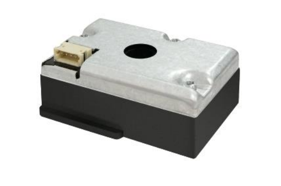
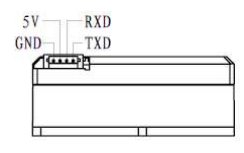

# PM100X Particulate Matter Sensors

The `pm100x` sensor platform integrates the PM1003, PM1006, and PM1006K particulate matter sensors with ESPHome over UART or PWM duty-cycle output.

|  |  |
| --- | --- |
| PM1003 | PM1006(K) |

## Model information

| Model | Example devices | Measurement range | Interfaces | Measures |
| --- | --- | --- | --- | --- |
| PM1003 | Levoit air purifiers (Vital100s, LV-131PUR) | 0–500 µg/m³ | UART, PWM | PM2.5 |
| PM1006 | IKEA VINDSTYRKA | 0–1000 µg/m³ | UART | PM2.5 |
| PM1006K | — | 0–1000 µg/m³ | UART, PWM | PM1.0, PM2.5, PM10.0 |

- **Supply voltage**: 5V
- **Signal level**: 4.5V TTL (UART and PWM)

## Wiring

PM100x devices communicate via UART at 9600 baud or expose a PWM duty-cycle output on P1. Choose one method (UART or PWM).

RX/TX and PWM are 4.5V TTL.
Use a level shifter (e.g: BSS138) for UART for 3.3V ESP boards.
For PWM, a 10k/20k resistor divider to GND is required to bring the signal to 3.3V.

```text
PM100X P1----[10k]----+----> ESP GPIO (3.3V)
                      |
                     [20k]
                      |
                     GND
```

### PM1003


| PM1003 pin | ESP pin | Notes |
| --- | --- | --- |
| 1 GND | GND | Ground. |
| 2 TX | RX | UART data from PM1003 to ESP. |
| 3 VDD | 5V | Power input. |
| 4 P1 | Any GPIO input | PWM duty-cycle output for PM2.5. |
| 5 RX | TX | UART data from ESP to PM1003 |

### PM1006/PM1006K



| PM1003 pin | ESP pin | Notes |
| --- | --- | --- |
| 1 GND | GND | Ground. |
| 2 VDD | 5V | Power input. |
| 3 RX | TX | UART data from ESP to PM1006/K |
| 4 TX | RX | UART data from PM1006/K to ESP. |

Info: Pin 4 on the PM1006K outputs pwm if no uart cmds are are received after startup. Maybe also the PM1006 (not verified!)

## Example configuration

### UART (active requests, PM1003 default)

```yaml
uart:
  rx_pin: GPIO22
  tx_pin: GPIO21
  baud_rate: 9600

sensor:
  - platform: pm100x
    update_interval: 15s
    pm_2_5:
      name: "PM2.5"

```

### PWM only (PM1003 or PM1006K)

```yaml
sensor:
  - platform: pm100x
    pm_2_5:
      name: "PM2.5"
    pwm:
      pin:
        number: GPIO27
        inverted: true
```

### UART (PM1006)

```yaml
uart:
  rx_pin: GPIO22
  tx_pin: GPIO21
  baud_rate: 9600

sensor:
  - platform: pm100x
    model: pm1006
    pm_2_5:
      name: "PM2.5"
```

### UART (PM1006K with PM1.0/PM10.0)

```yaml
uart:
  rx_pin: GPIO22
  tx_pin: GPIO21
  baud_rate: 9600

sensor:
  - platform: pm100x
    model: pm1006k
    pm_1_0:
      name: "PM1.0"
    pm_2_5:
      name: "PM2.5"
    pm_10_0:
      name: "PM10.0"
```

## Configuration variables

- **model** (*Optional*): PM100x model selection. One of `pm1003`, `pm1006`, `pm1006k`. Defaults to `pm1003`.
- **pm_2_5** (*Optional*): PM2.5 concentration in µg/m³. All options from Sensor. Required when `pwm` is configured.
- **pm_1_0** (*Optional*): PM1.0 concentration in µg/m³. Only supported on `pm1006k` and requires UART.
- **pm_10_0** (*Optional*): PM10.0 concentration in µg/m³. Only supported on `pm1006k` and requires UART.
- **pwm** (*Optional*): PWM duty-cycle input for PM2.5. When set, UART is not used.
  - **pin** (**Required**, GPIO input): Pin connected to PM1003 P1. Uses the ESPHome GPIO input pin schema.
- **uart_id** (*Optional*): ID of the UART bus to use when multiple UARTs are configured.
- **startup_delay** (*Optional*): Time to wait after boot before publishing measurements. Defaults to `15s`.
- **update_interval** (*Optional*): When using UART, this sets the measurement request interval. When using PWM, this sets the duty-cycle polling interval.

## Notes

- When `pwm` is configured, UART is not used.
- `pm1006` does not support PWM.
- `pm_1_0` and `pm_10_0` are only available on `pm1006k` and require UART.

## See also

- [Sensor Filters](/components/sensor#sensor-filters)
- [UART Component](/components/uart)
- 
- [ESPhome Levoit Air Purifiers- Project](https://github.com/tuct/esphome-projects/tree/main/projects/free-levoit)
