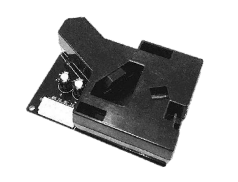
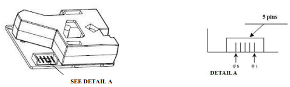

# PM1003 Particulate Matter Sensor



The `pm1003` sensor platform integrates the PM1003 particulate matter sensor with ESPHome over UART.

You can find this sensor in devices such as Levoit air purifiers (for example, the Vital100s and LV-131PUR).
The measurement range is 0–500 µg/m³.

It provides:

- **PM2.5** concentration (µg/m³)

## Wiring and UART

PM1003 communicates via UART at 9600 baud. Connect both RX and TX and set `update_interval`.


| PM1003 pin | ESP pin | Notes |
| --- | --- | --- |
| 1 GND | GND | Ground. |
| 2 TX | GPIO21 | UART data from PM1003 to ESP. |
| 3 VDD | 5V | Power input. |
| 4 P1 | NC | PWM out
| 5 RX | GPIO22 | UART data from ESP to PM1003 (required for active requests). |

RX/TX and PWM are 4.5V TTL. Use a level shifter or voltage divider for 3.3V ESP32 boards, it might work without but also might fry your esp32.

## Example configuration

```yaml
uart:
  rx_pin: GPIO22
  tx_pin: GPIO21
  baud_rate: 9600

sensor:
  - platform: pm1003
    update_interval: 15s
    pm_2_5:
      name: "PM2.5"

```

## Configuration variables

- **pm_2_5** (*Optional*): PM2.5 concentration in µg/m³. All options from Sensor.
- **uart_id** (*Optional*): ID of the UART bus to use when multiple UARTs are configured.
- **update_interval** (*Optional*): If you need to actively request measurements, set a sensible interval. Defaults to never.

## Notes

- When `update_interval` is set, the component sends the PM1003 request command automatically.
- The first request is delayed by 60 seconds after boot to match sensor warm-up behavior.

## See also

- [Sensor Filters](/components/sensor#sensor-filters)
- [UART Component](/components/uart)
- 
- [Esphome Levoit Air Purifiers- Project](https://github.com/tuct/esphome-projects/tree/main/projects/free-levoit)
