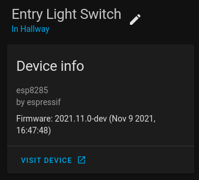

import PR from "@components/PR.astro";
import GHUser from "@components/GHUser.astro";

- [CSE7761](/components/sensor/cse7761/)
- [CAP1188 Capacitive Touch Sensor](/components/binary_sensor/cap1188/)
- [ESP32 Camera Web Server](/components/esp32_camera_web_server/)
- [Improv via Serial](/components/improv_serial/)

## State of the Open Smart Home

Mark your calendar for the [State of the Open Smart Home](https://www.home-assistant.io/state-of-the-open-home/)
hosted by Nabu Casa, Home Assistant & ESPHome and we'll be joined by our friends from WLED and Z-Wave JS to talk
about our work on making this vision a reality.

Where: YouTube

When: Saturday, December 11, at 11am PST / 8pm CET

{/* markdownlint-disable MD033 */}
<iframe width="560" height="315" src="https://www.youtube-nocookie.com/embed/6ZMXE5PXPqU"
        title="YouTube video player" frameborder="0"
        allow="accelerometer; autoplay; clipboard-write; encrypted-media; gyroscope; picture-in-picture"
        allowfullscreen></iframe>

## Improv via Serial

<improv-wifi-serial-launch-button>
    <i slot='unsupported'>The demo does not work in your browser. Use Google Chrome or Microsoft Edge.</i>
</improv-wifi-serial-launch-button>
{/* markdownlint-enable MD033 */}

After we created [Esp32 Improv](/components/esp32_improv/), we thought it might be a good idea to implement the same
for serial connections. See the docs here for [Improv via Serial](/components/improv_serial/) and the
[website documentation](https://www.improv-wifi.com/serial/) for implementing a client or implementing improv in
other firmware.

## Entity Categories for Home Assistant

Home Assistant 2021.11 added support for [Entity Categories](https://www.home-assistant.io/blog/2021/11/03/release-202111/#entity-categorization)
and with this release certain ESPHome entites such as the restart switch and uptime sensors will have the config and
diagnostic categories set respectively.
The category can be overridden by the user in the yaml configuration.

## Configuration URL

Another feature added to Home Assistant 2021.11 is the configuration URL. This allows for ESPHome devices to notify
Home Assistant when the `web_server` is enabled and there will be a button in the Home Assistant device page to
link directly to the `web_server` UI for your ESPHome device.

## Repeat Action

<GHUser name="oxan" /> has implemented a `repeat` action for those that want to execute a list of actions x number
of times without just copying and pasting them.

## Device name length

The maximum length of the device name has been limited to 31 characters to fall in line with standards and you will get
an error if you try to set a device name longer than that.

## BLE Sensor UUID changes

A bug was introduced in 2021.9 with the UUIDs for the `ble_client` sensors being reversed incorrectly. This release
flips them to be the correct way around and you will need to reverse them in your YAML configuration.

## BH1750

When using the default resolution of 0.5 for the BH1750, the result is now divided by 2 as per the finidings of
the community.

## Binary sensor device classes

<PR number={2703} /> removed the `update` `device_class` for binary sensors incorrectly in 2021.11.0.
<GHUser name="frenck" /> noticed this and has added it back again in 2021.11.1.

{/* markdownlint-disable MD013 */}

## Release 2021.11.1 - November 17

- Fix AQI index calculator <PR number={2739} /> by <GHUser name="freekode" />
- Re-instate device class update for binary sensors <PR number={2743} /> by <GHUser name="frenck" />

## Release 2021.11.2 - November 26

- Allow UART debug configuration with no after: definition <PR number={2753} /> by <GHUser name="mmakaay" />
- Fix gif frame scaling #2717 <PR number={2750} /> by <GHUser name="davet2001" />
- esp32_camera_web_server: Improve support for MotionEye <PR number={2777} /> by <GHUser name="ayufan" />
- Remove floating point ops from the ISR <PR number={2751} /> by <GHUser name="ssieb" />
- Fix parsing numbers from null-terminated buffers <PR number={2755} /> by <GHUser name="oxan" />

## Release 2021.11.3 - November 27

- Fix restoring preferences for ESP32 <PR number={2805} /> by <GHUser name="mmakaay" />

## Release 2021.11.4 - November 29

- Fix parsing numbers in Anova <PR number={2816} /> by <GHUser name="oxan" />
- Fix parsing of multiple values in EZO sensor <PR number={2814} /> by <GHUser name="oxan" />
- Fix compilation error for WPA enterprise in ESP-IDF <PR number={2815} /> by <GHUser name="CarlosGS" />
- Correct bitmask for third color (blue) scaling. <PR number={2817} /> by <GHUser name="davet2001" />
- Add delay to improve stability <PR number={2793} /> by <GHUser name="Conclusio" />

## Full list of changes

### New Features

- Make per-loop display clearing optional <PR number={2626} /> by <GHUser name="timn" /> (new-feature)
- Add Entity categories for Home Assistant <PR number={2636} /> by <GHUser name="jesserockz" /> (new-feature)
- Add repeat action for automations <PR number={2538} /> by <GHUser name="oxan" /> (new-feature)
- Neopixelbus redo method definitions <PR number={2616} /> by <GHUser name="OttoWinter" /> (new-feature) (breaking-change)

### New Components

- Feature/sensor cse7761 <PR number={2546} /> by <GHUser name="berfenger" /> (new-integration)
- Add `esp32_camera_web_server:` to expose mjpg/jpg images <PR number={2237} /> by <GHUser name="ayufan" /> (new-integration)
- CAP1188 Capacitive Touch Sensor Support <PR number={2653} /> by <GHUser name="MrEditor97" /> (new-integration)
- Implement Improv via Serial component <PR number={2423} /> by <GHUser name="jesserockz" /> (new-integration)

### Breaking Changes

- TCS34725 BugFix and GA factor <PR number={2445} /> by <GHUser name="razorback16" /> (breaking-change)
- Limit hostnames to 31 characters <PR number={2531} /> by <GHUser name="oxan" /> (breaking-change)
- Move default build path to .esphome directory <PR number={2586} /> by <GHUser name="OttoWinter" /> (breaking-change)
- ESP8266 disable PIO LDF <PR number={2608} /> by <GHUser name="OttoWinter" /> (breaking-change)
- Remove autoload of xiaomi_ble and ruuvi_ble <PR number={2617} /> by <GHUser name="spbrogan" /> (breaking-change)
- BH1750: Fix a too high default H-res2 mode value <PR number={2536} /> by <GHUser name="kixtarter" /> (breaking-change)
- Add option to use MQTT abbreviations <PR number={2641} /> by <GHUser name="paulmonigatti" /> (breaking-change)
- Add restore_mode to rotary_encoder <PR number={2643} /> by <GHUser name="niklasweber" /> (breaking-change)
- Neopixelbus redo method definitions <PR number={2616} /> by <GHUser name="OttoWinter" /> (new-feature) (breaking-change)
- Update device classes for binary sensors <PR number={2703} /> by <GHUser name="lcavalli" /> (breaking-change)
- BLE_Sensor: Use as_reversed_hex_array to properly parse UUIDs after #1627 <PR number={2737} /> by <GHUser name="tekmaven" /> (breaking-change)

### Beta Fixes

- Fix template number initial value being NaN <PR number={2692} /> by <GHUser name="jesserockz" />
- [remote_transmitter] accurate pulse timing for ESP8266 <PR number={2476} /> by <GHUser name="CarlosGS" />
- Uart debugging support <PR number={2478} /> by <GHUser name="mmakaay" />
- Enable addressable light power supply based on raw values <PR number={2690} /> by <GHUser name="oxan" />
- Remove my.ha links from improv <PR number={2695} /> by <GHUser name="jesserockz" />
- Only allow prometheus when using arduino <PR number={2697} /> by <GHUser name="jesserockz" />
- Update device classes for binary sensors <PR number={2703} /> by <GHUser name="lcavalli" /> (breaking-change)
- Bump ESPAsyncWebServer to 2.1.0 <PR number={2686} /> by <GHUser name="jesserockz" />
- Allow setting custom command_topic for Select and Number components <PR number={2714} /> by <GHUser name="kbialek" />
- Restore InterruptLock on wifi-less ESP8266 <PR number={2712} /> by <GHUser name="oxan" />
- Feed WDT between doing ESP32 touchpad measurements <PR number={2720} /> by <GHUser name="oxan" />
- RemoteTransmitter fix. Bug from version 2021.10. Some changes. <PR number={2706} /> by <GHUser name="dudanov" />
- Fix indentation of write_lambda for modbus_controller number <PR number={2722} /> by <GHUser name="jesserockz" />
- Remove unnecessary duplicate touch_pad_filter_start <PR number={2724} /> by <GHUser name="Maelstrom96" />
- Add zeroconf as a direct dependency and lock the version <PR number={2729} /> by <GHUser name="jesserockz" />
- Improv serial/checksum changes <PR number={2731} /> by <GHUser name="jesserockz" />
- Fix zeroconf time comparisons <PR number={2733} /> by <GHUser name="jesserockz" />
- BLE_Sensor: Use as_reversed_hex_array to properly parse UUIDs after #1627 <PR number={2737} /> by <GHUser name="tekmaven" /> (breaking-change)
- Fix senseair component uart read timeout <PR number={2658} /> by <GHUser name="rotarykite" />

### All changes

- TCS34725 BugFix and GA factor <PR number={2445} /> by <GHUser name="razorback16" /> (breaking-change)
- Change millis() to faster micros() for 3ms check in feed_wdt <PR number={2492} /> by <GHUser name="CarlosGS" />
- Add ESP32 IDF as a test env for PRs <PR number={2494} /> by <GHUser name="mmakaay" />
- use no hold master mode for si7021/htu21d <PR number={2528} /> by <GHUser name="dmitriy5181" />
- Bump pyyaml from 5.4.1 to 6.0 <PR number={2521} /> by [@dependabot[bot]](https://github.com/dependabot[bot])
- Clarify statement at the cmd wizard tool, for new users <PR number={2519} /> by <GHUser name="CarlosGS" />
- Continue ethernet setup if hostname fails <PR number={2430} /> by <GHUser name="Tommatheussen" />
- Bump aioesphomeapi from 9.1.5 to 10.0.0 <PR number={2508} /> by [@dependabot[bot]](https://github.com/dependabot[bot])
- Move TemplatableValue helper class to automation.h <PR number={2511} /> by <GHUser name="oxan" />
- [esp-idf fix] increase FreeRTOS ticker loop from 100Hz to 1kHz <PR number={2527} /> by <GHUser name="CarlosGS" />
- Bump pytest-asyncio from 0.15.1 to 0.16.0 <PR number={2547} /> by [@dependabot[bot]](https://github.com/dependabot[bot])
- [ESP32] ADC auto-range setting <PR number={2541} /> by <GHUser name="CarlosGS" />
- Bump paho-mqtt from 1.5.1 to 1.6.0 <PR number={2568} /> by [@dependabot[bot]](https://github.com/dependabot[bot])
- Fix ESP8266 dallas GPIO16 INPUT_PULLUP <PR number={2581} /> by <GHUser name="OttoWinter" />
- Fix platformio version in Dockerfile doesn't match requirements <PR number={2582} /> by <GHUser name="OttoWinter" />
- Fix platformio_install_deps no longer installing all lib_deps <PR number={2584} /> by <GHUser name="OttoWinter" />
- ESP32 ADC use factory calibration data <PR number={2574} /> by <GHUser name="OttoWinter" />
- Add mDNS config dump <PR number={2576} /> by <GHUser name="mmakaay" />
- Fix mDNS ESP8266 log not included <PR number={2589} /> by <GHUser name="OttoWinter" />
- Bump platformio from 5.2.1 to 5.2.2 <PR number={2569} /> by [@dependabot[bot]](https://github.com/dependabot[bot])
- Update docker base images <PR number={2583} /> by <GHUser name="OttoWinter" />
- Bump paho-mqtt from 1.6.0 to 1.6.1 <PR number={2596} /> by [@dependabot[bot]](https://github.com/dependabot[bot])
- Logging a proper url allows terminals to make it clickable <PR number={2554} /> by <GHUser name="jesserockz" />
- Bump aioesphomeapi from 10.0.0 to 10.0.3 <PR number={2595} /> by [@dependabot[bot]](https://github.com/dependabot[bot])
- Bump tzlocal from 3.0 to 4.0.1 <PR number={2553} /> by [@dependabot[bot]](https://github.com/dependabot[bot])
- Add IDF support to dallas <PR number={2578} /> by <GHUser name="OttoWinter" />
- Limit hostnames to 31 characters <PR number={2531} /> by <GHUser name="oxan" /> (breaking-change)
- Add EntityBase properties to ESP32 Camera <PR number={2600} /> by <GHUser name="paulmonigatti" />
- Move default build path to .esphome directory <PR number={2586} /> by <GHUser name="OttoWinter" /> (breaking-change)
- ESP8266 disable PIO LDF <PR number={2608} /> by <GHUser name="OttoWinter" /> (breaking-change)
- Switch issue-close-app to GH Actions and workflow cleanup <PR number={2624} /> by <GHUser name="OttoWinter" />
- relax max entities checking <PR number={2629} /> by <GHUser name="martgras" />
- Allow setting URL as platform_version <PR number={2598} /> by <GHUser name="oxan" />
- Constrain GH Actions workflows permissions <PR number={2625} /> by <GHUser name="OttoWinter" />
- Bump tzlocal from 4.0.1 to 4.0.2 <PR number={2631} /> by [@dependabot[bot]](https://github.com/dependabot[bot])
- Bump esptool from 3.1 to 3.2 <PR number={2632} /> by [@dependabot[bot]](https://github.com/dependabot[bot])
- Add publish_initial_value option to rotary encoder <PR number={2503} /> by <GHUser name="niklasweber" />
- Remove autoload of xiaomi_ble and ruuvi_ble <PR number={2617} /> by <GHUser name="spbrogan" /> (breaking-change)
- Bump aioesphomeapi from 10.0.3 to 10.1.0 <PR number={2638} /> by [@dependabot[bot]](https://github.com/dependabot[bot])
- Expose web_server port via the API <PR number={2467} /> by <GHUser name="alexiri" />
- Allow cloning/fetching Github PR branches in external_components <PR number={2639} /> by <GHUser name="jesserockz" />
- use update_interval for sntp synchronization <PR number={2563} /> by <GHUser name="martgras" />
- Feature/sensor cse7761 <PR number={2546} /> by <GHUser name="berfenger" /> (new-integration)
- Bump aioesphomeapi from 10.1.0 to 10.2.0 <PR number={2642} /> by [@dependabot[bot]](https://github.com/dependabot[bot])
- BH1750: Fix a too high default H-res2 mode value <PR number={2536} /> by <GHUser name="kixtarter" /> (breaking-change)
- Bump tzlocal from 4.0.2 to 4.1 <PR number={2645} /> by [@dependabot[bot]](https://github.com/dependabot[bot])
- convert SCD30 into Component, polls dataready register <PR number={2308} /> by <GHUser name="geoffrey-vl" />
- Add option to use MQTT abbreviations <PR number={2641} /> by <GHUser name="paulmonigatti" /> (breaking-change)
- Fix deep sleep invert_wakeup mode <PR number={2644} /> by <GHUser name="OttoWinter" />
- Expose webserver_port to the native API <PR number={2640} /> by <GHUser name="jesserockz" />
- Fix for noise in pulse_counter and duty_cycle components <PR number={2646} /> by <GHUser name="CarlosGS" />
- Bump black from 21.9b0 to 21.10b0 <PR number={2650} /> by [@dependabot[bot]](https://github.com/dependabot[bot])
- Add restore_mode to rotary_encoder <PR number={2643} /> by <GHUser name="niklasweber" /> (breaking-change)
- Make per-loop display clearing optional <PR number={2626} /> by <GHUser name="timn" /> (new-feature)
- Allow esp8266 to compile with no wifi <PR number={2664} /> by <GHUser name="glmnet" />
- Fix CRC error during DSMR chunked message reading <PR number={2622} /> by <GHUser name="mmakaay" />
- Add Entity categories for Home Assistant <PR number={2636} /> by <GHUser name="jesserockz" /> (new-feature)
- Add SPI lib for ESP8266 and only add lib for ESP32 when using Arduino <PR number={2677} /> by <GHUser name="mmakaay" />
- Hotfix for encrypted DSMR regression <PR number={2679} /> by <GHUser name="mmakaay" />
- Add HA Entity Category support to MQTT <PR number={2678} /> by <GHUser name="paulmonigatti" />
- Fix gpio validation for esp32 variants <PR number={2609} /> by <GHUser name="martgras" />
- Fix when package url has no branch/ref <PR number={2683} /> by <GHUser name="jesserockz" />
- SSD1306_base -> Add support for 64x32 size and fix typo for flip functions <PR number={2682} /> by <GHUser name="ychieux" />
- Fix dashboard imports for adoption <PR number={2684} /> by <GHUser name="jesserockz" />
- Add `esp32_camera_web_server:` to expose mjpg/jpg images <PR number={2237} /> by <GHUser name="ayufan" /> (new-integration)
- fix esp32 rmt receiver item array length <PR number={2671} /> by <GHUser name="glmnet" />
- Remote base add pronto protocol <PR number={2619} /> by <GHUser name="cvwillegen" />
- Set up output_switch at priority DATA instead of HARDWARE. <PR number={2648} /> by <GHUser name="duncf" />
- fix rc switch protocol 6 <PR number={2672} /> by <GHUser name="glmnet" />
- Remove "delay_microseconds_accurate()" and improve systemwide delayMicroseconds() <PR number={2497} /> by <GHUser name="CarlosGS" />
- modbus_controller: remove hard coded register size <PR number={2654} /> by <GHUser name="martgras" />
- CAP1188 Capacitive Touch Sensor Support <PR number={2653} /> by <GHUser name="MrEditor97" /> (new-integration)
- Add missing hal.h include in esp32_camera_web_server <PR number={2689} /> by <GHUser name="oxan" />
- [ESP32 ADC] Add option for raw uncalibrated output <PR number={2663} /> by <GHUser name="CarlosGS" />
- Introduce parse_number() helper function <PR number={2659} /> by <GHUser name="oxan" />
- Add repeat action for automations <PR number={2538} /> by <GHUser name="oxan" /> (new-feature)
- Neopixelbus redo method definitions <PR number={2616} /> by <GHUser name="OttoWinter" /> (new-feature) (breaking-change)
- Introduce byteswap helpers <PR number={2661} /> by <GHUser name="oxan" />
- Max7219digit multiline <PR number={1622} /> by <GHUser name="TVDLoewe" />
- Clean-up string sanitization helpers <PR number={2660} /> by <GHUser name="oxan" />
- Introduce encode_value/decode_value() template functions <PR number={2662} /> by <GHUser name="oxan" />
- Make OTA function switchable in web_server component <PR number={2685} /> by <GHUser name="lazlyhu" />
- Implement Improv via Serial component <PR number={2423} /> by <GHUser name="jesserockz" /> (new-integration)
- [ms5611]: Re-implement conversion from ADC readings to sensor values <PR number={2665} /> by <GHUser name="anatoly-savchenkov" />
- Fix template number initial value being NaN <PR number={2692} /> by <GHUser name="jesserockz" />
- [remote_transmitter] accurate pulse timing for ESP8266 <PR number={2476} /> by <GHUser name="CarlosGS" />
- Uart debugging support <PR number={2478} /> by <GHUser name="mmakaay" />
- Enable addressable light power supply based on raw values <PR number={2690} /> by <GHUser name="oxan" />
- Remove my.ha links from improv <PR number={2695} /> by <GHUser name="jesserockz" />
- Only allow prometheus when using arduino <PR number={2697} /> by <GHUser name="jesserockz" />
- Update device classes for binary sensors <PR number={2703} /> by <GHUser name="lcavalli" /> (breaking-change)
- Bump ESPAsyncWebServer to 2.1.0 <PR number={2686} /> by <GHUser name="jesserockz" />
- Allow setting custom command_topic for Select and Number components <PR number={2714} /> by <GHUser name="kbialek" />
- Restore InterruptLock on wifi-less ESP8266 <PR number={2712} /> by <GHUser name="oxan" />
- Feed WDT between doing ESP32 touchpad measurements <PR number={2720} /> by <GHUser name="oxan" />
- RemoteTransmitter fix. Bug from version 2021.10. Some changes. <PR number={2706} /> by <GHUser name="dudanov" />
- Fix indentation of write_lambda for modbus_controller number <PR number={2722} /> by <GHUser name="jesserockz" />
- Remove unnecessary duplicate touch_pad_filter_start <PR number={2724} /> by <GHUser name="Maelstrom96" />
- Add zeroconf as a direct dependency and lock the version <PR number={2729} /> by <GHUser name="jesserockz" />
- Improv serial/checksum changes <PR number={2731} /> by <GHUser name="jesserockz" />
- Fix zeroconf time comparisons <PR number={2733} /> by <GHUser name="jesserockz" />
- BLE_Sensor: Use as_reversed_hex_array to properly parse UUIDs after #1627 <PR number={2737} /> by <GHUser name="tekmaven" /> (breaking-change)
- Fix senseair component uart read timeout <PR number={2658} /> by <GHUser name="rotarykite" />
- Fix AQI index calculator <PR number={2739} /> by <GHUser name="freekode" />
- Re-instate device class update for binary sensors <PR number={2743} /> by <GHUser name="frenck" />
- Allow UART debug configuration with no after: definition <PR number={2753} /> by <GHUser name="mmakaay" />
- Fix gif frame scaling #2717 <PR number={2750} /> by <GHUser name="davet2001" />
- esp32_camera_web_server: Improve support for MotionEye <PR number={2777} /> by <GHUser name="ayufan" />
- Remove floating point ops from the ISR <PR number={2751} /> by <GHUser name="ssieb" />
- Fix parsing numbers from null-terminated buffers <PR number={2755} /> by <GHUser name="oxan" />
- Fix restoring preferences for ESP32 <PR number={2805} /> by <GHUser name="mmakaay" />
- Fix parsing numbers in Anova <PR number={2816} /> by <GHUser name="oxan" />
- Fix parsing of multiple values in EZO sensor <PR number={2814} /> by <GHUser name="oxan" />
- Fix compilation error for WPA enterprise in ESP-IDF <PR number={2815} /> by <GHUser name="CarlosGS" />
- Correct bitmask for third color (blue) scaling. <PR number={2817} /> by <GHUser name="davet2001" />
- Add delay to improve stability <PR number={2793} /> by <GHUser name="Conclusio" />

{/* markdownlint-enable MD013 */}

## All Changelogs

