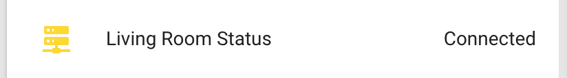

The Status Binary Sensor exposes the node state (if it's connected to via MQTT/native API)
for Home Assistant.



```yaml
# Example configuration entry
binary_sensor:
  - platform: status
    name: "Living Room Status"
```

## Configuration variables

- All options from [Binary Sensor](/components/binary_sensor#config-binary_sensor). (Inverted mode is not supported)

## See Also

- [Binary Sensor](/components/binary_sensor/)
- [Mqtt](/components/mqtt/)
