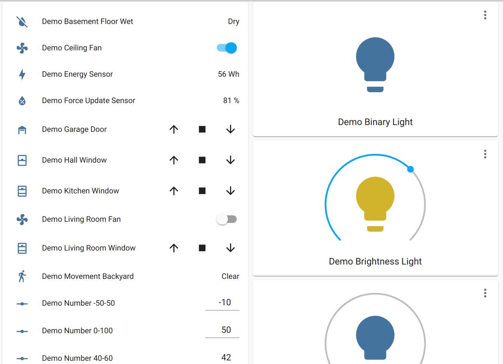

The `demo` component can be used for testing to generate sample instances of many
different components (sensors, lights, ...)



```yaml
# Example configuration entry
demo:
```

## Configuration variables

This component has no configuration variables
