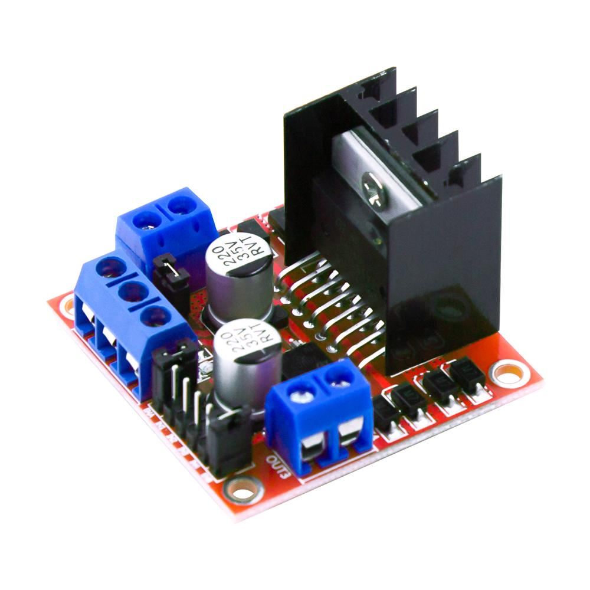
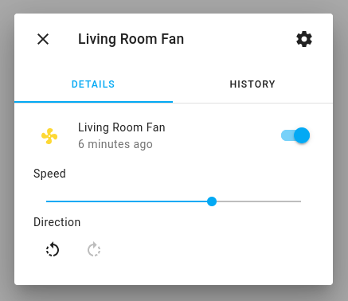

The `hbridge` fan platform allows you to use a compatible *h-bridge* (L298N, DRV8871, MX1508, BTS7960, L9110S, DRV8833, TB6612, etc.) to control a fan (or motor/solenoid).





```yaml
# Example configuration entry
fan:
  - platform: hbridge
    id: my_fan
    name: "Living Room Fan"
    pin_a: motor_forward_pin
    pin_b: motor_reverse_pin
    # enable_pin: motor_enable
    decay_mode: slow   # slow decay mode (coasting) or fast decay (braking).
```

## Configuration variables

- **pin_a** (**Required**, [ID](/guides/configuration-types#id)): The id of the
  [float output](/components/output#output) connected to Pin A (alternatively IN1, etc.) of the h-bridge.

- **pin_b** (**Required**, [ID](/guides/configuration-types#id)): The id of the
  [float output](/components/output#output) connected to Pin B (alternatively IN2, etc.) of the h-bridge.

- **enable_pin** (*Optional*, [ID](/guides/configuration-types#id)): The id of the
  [float output](/components/output#output) connected to the Enable pin of the h-bridge (if h-bridge uses enable).

- **decay_mode** (*Optional*, string): The decay mode you want to use with
  the h-bridge. Either `slow` (coasting) or `fast` (braking). Defaults to `slow`.

- **speed_count** (*Optional*, int): Set the number of supported discrete speed levels. The value is used
  to calculate the percentages for each speed. E.g. `2` means that you have 50% and 100% while `100`
  will allow 1% increments in the output. Defaults to `100`.

- **preset_modes** (*Optional*): A list of preset modes for this fan. Preset modes can be used in automations (i.e. `on_preset_set`  ).
- All other options from [Fan Component](/components/fan#config-fan).

<span id="fan-hbridge_brake_action"></span>

## `fan.hbridge.brake` Action

Set all h-bridge pins high, shorting the fan/motor's windings and forcing the motor to actively stop.

```yaml
on_...:
  then:
    - fan.hbridge.brake: my_fan
```

## See Also

- [Output](/components/output/)
- [Fan](/components/fan/)
- [Ledc](/components/output/ledc/)
- [Esp8266 Pwm](/components/output/esp8266_pwm/)
- [Adafruit's excellent H-bridge tutorial](https://learn.adafruit.com/improve-brushed-dc-motor-performance)
