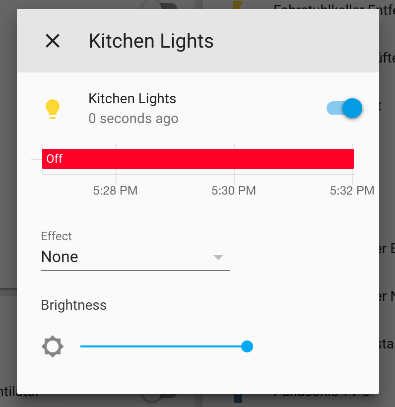
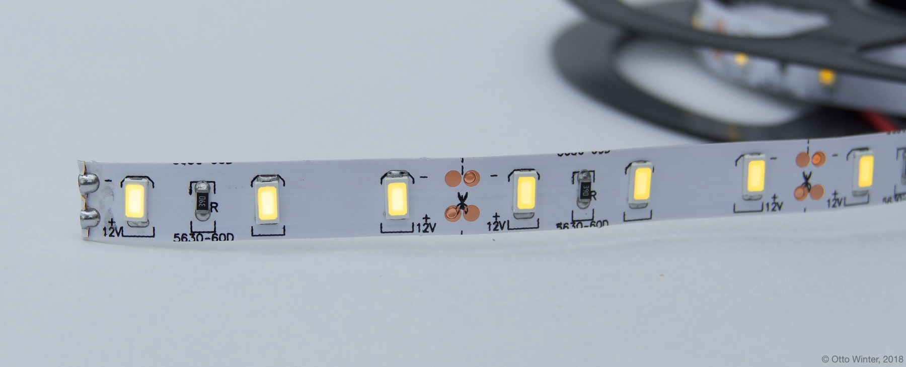

The `monochromatic` light platform creates a simple brightness-only light from a
[float output component](/components/output#output).




```yaml
# Example configuration entry
light:
  - platform: monochromatic
    name: "Kitchen Lights"
    output: output_component1
```

## Configuration variables

- **output** (**Required**, [ID](/guides/configuration-types#id)): The id of the float [Output Component](/components/output#output) to use for this light.
- All other options from [Light](/components/light#config-light).

## See Also



- [Output](/components/output/)
- [Light](/components/light/)
- [Binary](/components/light/binary/)
- [Power Supply](/components/power_supply/)
- [Ledc](/components/output/ledc/)
- [Esp8266 Pwm](/components/output/esp8266_pwm/)
- [Pca9685](/components/output/pca9685/)
- [Tlc59208F](/components/output/tlc59208f/)
- [My9231](/components/output/my9231/)
