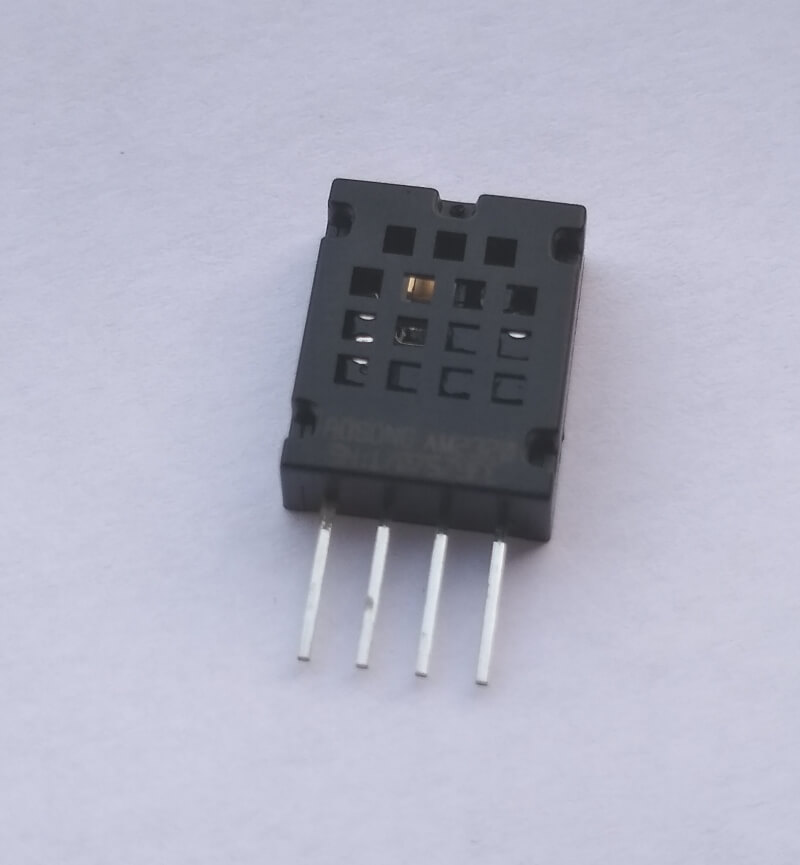
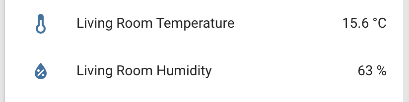

The `am2320` Temperature+Humidity sensor allows you to use your AM2320
([datasheet](https://cdn-shop.adafruit.com/product-files/3721/AM2320.pdf)) I²C-based sensor with
ESPHome.





:::note
Logs might include some warnings about receiving a NACK from the sensor.
This is due to a wake call to the sensor which the sensor never acknowledges by design.
:::

```yaml
# Example configuration entry
sensor:
  - platform: am2320
    temperature:
      name: "Living Room Temperature"
    humidity:
      name: "Living Room Humidity"
    update_interval: 60s
```

## Configuration variables

- **temperature** (**Required**): The information for the temperature sensor.

  - All options from [Sensor](/components/sensor).

- **humidity** (**Required**): The information for the humidity sensor

  - All options from [Sensor](/components/sensor).

- **update_interval** (*Optional*, [Time](/guides/configuration-types#time)): The interval to check the sensor. Defaults to
  `60s`.

## Troubleshooting

If you experience communication or reliability issues with the AM2320 sensor, the
[I2C](/i2c/) frequency may be too high. The AM2320 supports I²C standard-mode with a maximum
clock frequency of 100 kHz.

## See Also

- [Sensor Filters](/components/sensor#sensor-filters)
- [I2C](/i2c/)
- [Absolute Humidity](/absolute_humidity/)
- [Dht](/dht/)
- [Dht12](/dht12/)
- [Hdc1080](/hdc1080/)
- [Htu21D](/htu21d/)
- [Sht3Xd](/sht3xd/)
- 
- [AM2320 Library](https://github.com/EngDial/AM2320) by [Aleksey](https://github.com/EngDial)
