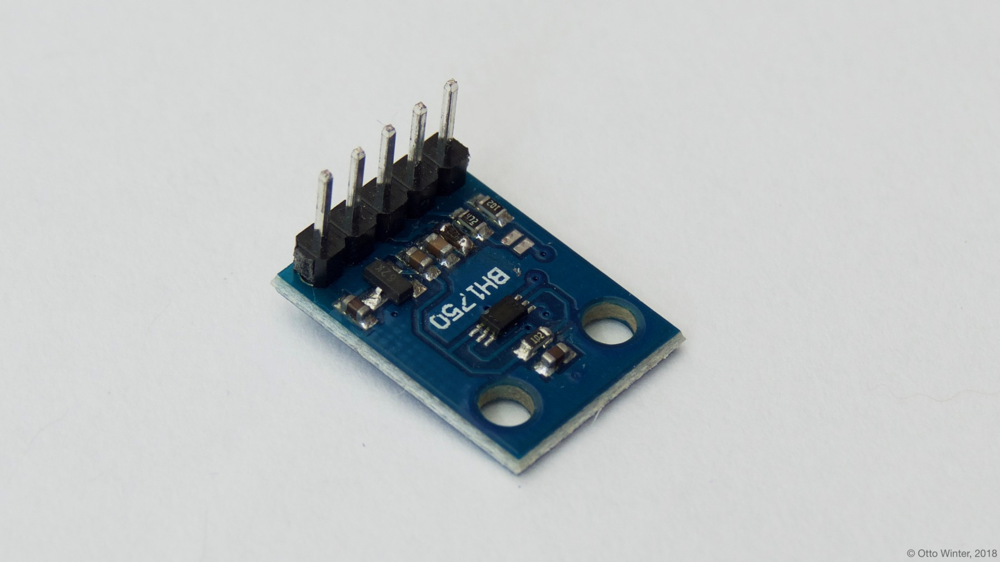
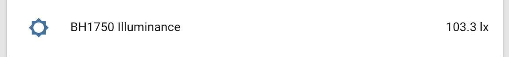

<span id="bh1750"></span>

The `bh1750` sensor platform allows you to use your BH1750
([datasheet](http://www.mouser.com/ds/2/348/bh1750fvi-e-186247.pdf))
ambient light sensor with ESPHome. The [I²C bus](/components/i2c) is required to be set up in
your configuration for this sensor to work.





```yaml
# Example configuration entry
sensor:
  - platform: bh1750
    name: "BH1750 Illuminance"
    address: 0x23
    update_interval: 60s
```

## Configuration variables

- **address** (*Optional*, int): Manually specify the I²C address of the sensor.
  Defaults to `0x23` (address if address pin is pulled low). If the address pin is pulled high,
  the address is `0x5C`.

- **update_interval** (*Optional*, [Time](/guides/configuration-types#time)): The interval to check the
  sensor. Defaults to `60s`.

- All other options from [Sensor](/components/sensor).

## See Also

- [Sensor Filters](/components/sensor#sensor-filters)
- [Opt3001](/opt3001/)
- [Tsl2561](/tsl2561/)
- [Tsl2591](/tsl2591/)
- 
- [BH1750 Library](https://github.com/claws/BH1750) by [@claws](https://github.com/claws)
