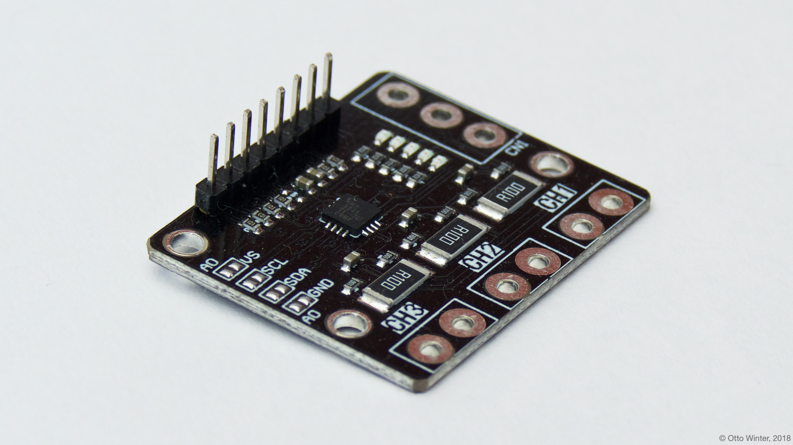
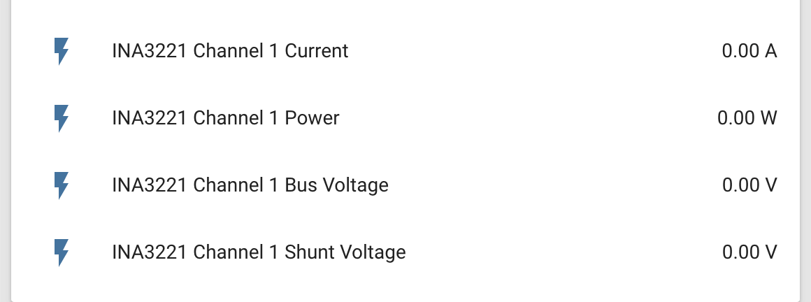
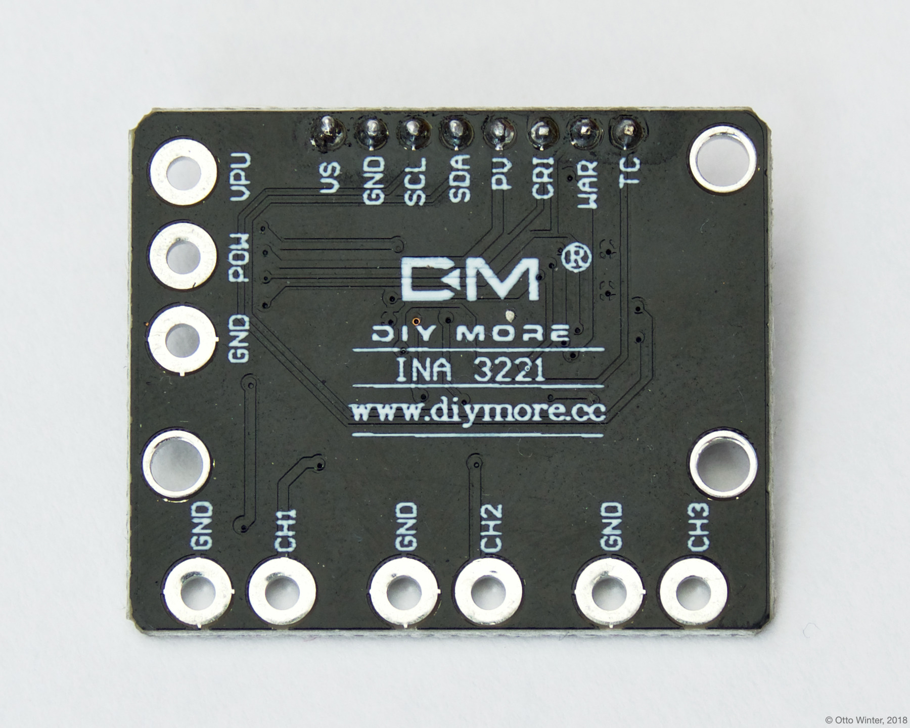

The `ina3221` sensor platform allows you to use your INA3221 3-Channel DC Current Sensor
([datasheet](http://www.ti.com/lit/ds/symlink/ina3221.pdf),
[switchdoc](http://www.switchdoc.com/ina3221-breakout-board/)) sensors with
ESPHome. The [I²C Bus](/components/i2c) is
required to be set up in your configuration for this sensor to work.





```yaml
# Example configuration entry
sensor:
  - platform: ina3221
    address: 0x40
    channel_1:
      shunt_resistance: 0.1 ohm
      current:
        name: "INA3221 Channel 1 Current"
      power:
        name: "INA3221 Channel 1 Power"
      bus_voltage:
        name: "INA3221 Channel 1 Bus Voltage"
      shunt_voltage:
        name: "INA3221 Channel 1 Shunt Voltage"
    channel_2:
      # ...
    channel_3:
      # ...
    update_interval: 60s
```

## Configuration variables

- **address** (*Optional*, int): Manually specify the I²C address of the sensor. Defaults to `0x40`.
- **channel_1** (*Optional*): The configuration options for the 1st channel.

  - **shunt_resistance** (*Optional*, float): The value of the shunt resistor on this channel for current calculation.
    Defaults to `0.1 ohm`.

  - **current** (*Optional*): Use the current value on this channel in amperes. All options from
    [Sensor](/components/sensor).

  - **power** (*Optional*): Use the power value on this channel in watts. All options from
    [Sensor](/components/sensor).

  - **bus_voltage** (*Optional*): Use the bus voltage (voltage of the high side contact) value on this channel in V.
    All options from [Sensor](/components/sensor).

  - **shunt_voltage** (*Optional*): Use the shunt voltage (voltage across the shunt resistor) value on this channel in V.
    All options from [Sensor](/components/sensor).

- **channel_2** (*Optional*): The configuration options for the 2nd channel. Same options as 1st channel.
- **channel_3** (*Optional*): The configuration options for the 3rd channel. Same options as 1st channel.
- **update_interval** (*Optional*, [Time](/guides/configuration-types#time)): The interval to check the sensor. Defaults to `60s`.



## See Also

- [Sensor Filters](/components/sensor#sensor-filters)
- [Ina219](/ina219/)
- 
- [INA3221 Arduino Library](https://github.com/switchdoclabs/SDL_Arduino_INA3221) by [SwitchDoc Labs](https://github.com/switchdoclabs)
