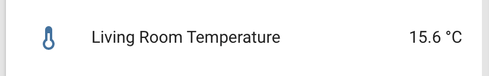

The `sts3x` sensor platform Temperature sensor allows you to use your Sensirion STS30-DIS, STS31-DIS or STS35-DIS
([datasheet](https://sensirion.com/media/documents/1DA31AFD/65D613A8/Datasheet_STS3x_DIS.pdf),
[Sensirion STS3x](https://www.sensirion.com/sts3x/)) sensors with
ESPHome. The [I²C Bus](/components/i2c) is
required to be set up in your configuration for this sensor to work.



```yaml
# Example configuration entry
sensor:
  - platform: sts3x
    name: "Living Room Temperature"
    address: 0x4A
    update_interval: 60s
```

## Configuration variables

- **address** (*Optional*, int): Manually specify the I²C address of the sensor.
  Defaults to `0x4A`.

- **update_interval** (*Optional*, [Time](/guides/configuration-types#time)): The interval to check the
  sensor. Defaults to `60s`.

- All other options from [Sensor](/components/sensor).

## See Also

- [Sensor Filters](/components/sensor#sensor-filters)
- [Dht](/dht/)
- [Dht12](/dht12/)
- [Hdc1080](/hdc1080/)
- [Htu21D](/htu21d/)
- [Sht3Xd](/sht3xd/)
- 
