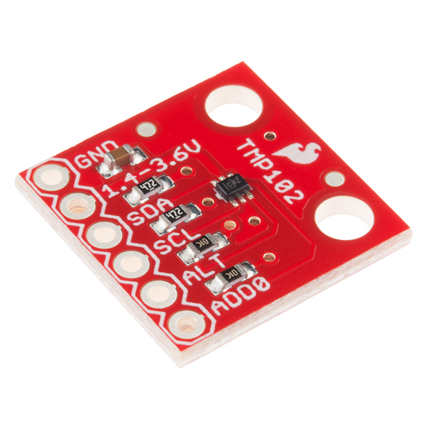

The TMP102 Temperature sensor allows you to use your TMP102
([Sparkfun](https://www.sparkfun.com/products/13314)) and LM75 sensors with
ESPHome. The [I²C Bus](/components/i2c) is required to be set up in your
configuration for this sensor to work.




```yaml
# Example configuration entry
sensor:
  - platform: tmp102
    name: "Living Room Temperature"
    update_interval: 60s
```

## Configuration variables

- **update_interval** (*Optional*, [Time](/guides/configuration-types#time)): The interval to check the sensor. Defaults to `60s`.
- **address** (*Optional*, int): The I²C address of the sensor. Defaults to `0x48`.
  See [I²C Addresses](/components/sensor/tmp117#tmp117_i2c_addresses) for more information.

- All other options from [Sensor](/components/sensor).

## See Also

- [Sensor Filters](/components/sensor#sensor-filters)
- [Dht](/dht/)
- [Dht12](/dht12/)
- [Hdc1080](/hdc1080/)
- [Sht3Xd](/sht3xd/)
- [Htu21D](/htu21d/)
- 
