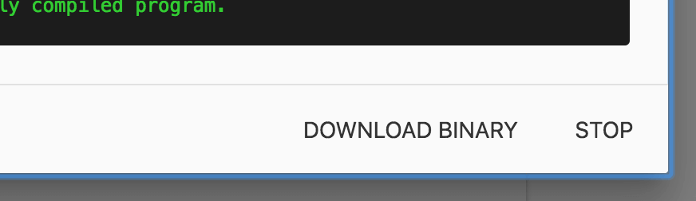
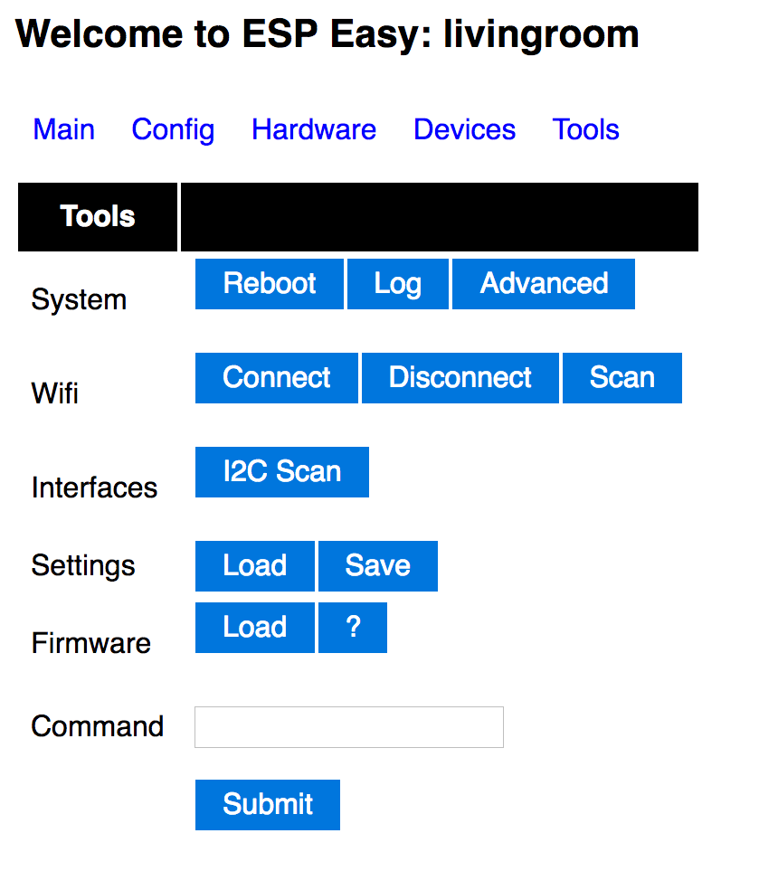

Migrating from previous ESPEasy setups is very easy. You just need to have
ESPHome create a binary for you and then upload that in the ESPEasy web interface.

## Getting Binary

First follow the guides for the [different supported devices](/components#devices) and create a configuration
file. Then, generate and download the binary:

- **Using the Home Assistant add-on/dashboard**: Just click the `COMPILE` button,
  wait for the compilation to end and press the `DOWNLOAD BINARY` button.

- **Using the command line**: run `esphome compile livingroom.yaml` (replacing
  `livingroom.yaml` with your configuration file of course) and navigate to the
  `<NODE_NAME>/.pioenvs/<NODE_NAME>/` folder. There you will find a `firmware.bin` file,
  this is the binary you will upload.

## Uploading Binary

To upload the binary, navigate to the ESPEasy web interface and enter the
"Tools " section.

Press "Load" under Firmware, then select the binary you previously downloaded and upload
the binary. If everything succeeds, you should now have ESPHome on your node 🎉.

:::note
with ESPHome, you in most cases won't need to worry about the available flash size, as
the binary only ever includes the code that you are actually using.
:::

Happy Hacking!

## See Also

- [Esp8266](/components/esp8266/)
- [Esp32](/components/esp32/)
- [Migrate Espurna](/migrate_espurna/)
- [Migrate Sonoff Tasmota](/migrate_sonoff_tasmota/)
